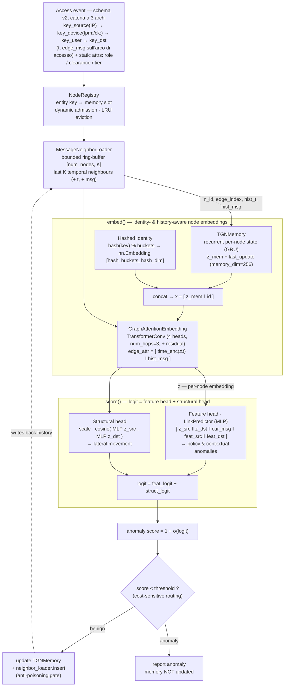

# Graphagate


<br/>


GNN model training and serving microservice (and standalone), specialized in
**unsupervised anomaly detection** for ZTA intrusion detection/prevention systems.

## Overview (Temporal Graph Network)

Graphagate analizza un **flusso di accessi Zero-Trust** continuo e in tempo reale utilizzando una
**Temporal Graph Network (TGN)**. Ogni accesso (una richiesta *IP/device → risorsa*) rappresenta un
arco temporale (edge) contenente segnali Zero-Trust; il modello mantiene una **memoria** ricorrente del
comportamento di ciascuna entità e una cronologia limitata dei suoi **vicini temporali** recenti,
assegnando uno score a ogni nuovo evento in modo sequenziale.

- **Unsupervised anomaly detection** — addestrato esclusivamente su traffico benigno tramite negative
  sampling. Per ogni evento benigno il modello viene spinto verso *benigno* e su tre tipi di
  perturbazione verso *anomalo*; lo score di anomalia è calcolato come `1 − P(benign)`.
- **Tre classi di anomalie rilevate** — *contestuale* (fiducia TLS compromessa / allarmi
  dai sensori), *policy* (un'entità che agisce al di fuori del proprio ruolo/clearance/tier), e *movimento
  laterale* (un accesso autorizzato ma **non abituale** — stesse feature d'arco del traffico benigno,
  rilevabile esclusivamente tramite lo storico delle interazioni).
- **Serving in tempo reale** — `src/serve_tgn.py` espone le primitive (`load_model`,
  `infer_score`, `update_memory`, `score_event`, `commit_event`) e `src/serve_api.py`
  le incapsula in un **microservizio di inferenza REST/JSON** (`graphagate.serve_api`, profilo Compose
  `serve-tgn`) interrogabile da un orchestrator ZTA tramite HTTP. Il calcolo dello score avviene
  evento per evento; la memoria e lo storico del vicinato vengono aggiornati **solo per gli eventi
  classificati come benigni** (anti-poisoning gate), e un `NodeRegistry` ammette dinamicamente
  entità mai viste prima a runtime (spazio dei nodi dinamico). Gli artifact per il deploy sono
  `public/tgn_checkpoint.pt` (pesi + memoria + raw-message store + buffer del vicinato) e
  `public/tgn_stats.json` (soglia calibrata + registro). Verifica disponibile con
  `python -m graphagate.verify_tgn`. Dettagli sull'integrazione (endpoint, flusso anti-poisoning OPA)
  in [`docs/orchestrator_integration.md`](docs/orchestrator_integration.md).

## Architettura del modello

Il modello (`src/model/tgn.py`, classe `ZTATemporalGraphNetwork`) combina la memoria
ricorrente del TGN canonico (Rossi et al., 2020) con un **neighbour loader bounded in RAM**
(nessun graph DB) e uno **scorer a due teste** — una basata sulle feature e una di
compatibilità strutturale — che insieme coprono le tre classi di anomalia.



### Componenti e a cosa servono

| Componente (`attributo`) | Ruolo |
|---|---|
| **TGNMemory** (`memory`) | Stato ricorrente per-nodo aggiornato via GRU dai messaggi degli eventi: la "memoria storica" del comportamento di ogni entità. Espone `z_mem` e `last_update`. `memory_dim` è stata aumentata a 256 per gestire l'impronta comportamentale complessa. |
| **Hashed Identity** (`hash_emb`) | Embedding apprendibile via hashing deterministico della chiave (`stable_hash`, BLAKE2b). Mantiene induttività al 100% per i nodi nuovi e dà a ogni entità — incluse le **risorse** — un'identità distinguibile. *Nota onesta:* l'ablation multi-seed mostra che per il lateral è ormai **ridondante** (sussunta dalle feature di storia esplicite: rimuoverla non peggiora il lateral AUC). |
| **History features** (`compute_hist_feats`) | Per ogni evento `[log1p(pair_count), log1p(src_count), pair/(src+1)]`: contatori d'interazione causali e *benign-gated* (derivabili a runtime, non circolari). Iniettano il segnale di **novità** della coppia src→dst. Ablation: **+0.066 AUC** sul lateral. |
| **Kill-chain precursor** (`recent_alert`, `precursor_boost`) | Prior moltiplicativo *serving-time* che alza lo score di un'entità subito dopo un suo alert (recon→lateral), con decadimento `0.5^(Δt/half_life)`. Stato fuori dalla memoria TGN (il gate scarterebbe il precursore); **non** è un input addestrato. Ablation: **+0.073 AUC** sul lateral, senza costo di precisione. |
| **Static node features** (`node_feat`) | Attributi statici ZTA per-nodo (device tier, trust_score), buffer `[num_nodes, 16]`. |
| **MessageNeighborLoader** (`neighbor_loader`) | Ring-buffer **bounded in RAM** con gli ultimi `neighbor_size=30` vicini temporali per nodo. Abilita il message-passing sul vicinato storico — il segnale **strutturale** per il lateral movement — con memoria `O(num_nodes·K·msg_dim)` costante. **Nessun database a grafo.** |
| **GraphAttentionEmbedding** (`gnn`) | Reti multi-hop (`num_hops=3`) di `TransformerConv` (4 teste, con connessioni residuali) che calcolano l'embedding di nodo `z` attendendo sui vicini temporali estesi; `edge_attr` = encoding del tempo relativo `Δt` concatenato al messaggio storico dell'arco. |
| **Feature head** (`link_pred`, `LinkPredictor`) | MLP su `[z_src, z_dst, cur_msg, feat_src, feat_dst, Δt_enc, history_feats]`. Allenata con un obiettivo **InfoNCE** (ranking della dst vera sopra K casuali) + ancora BCE positiva + BCE contestuale. È la testa che — con memoria + history feats — porta il segnale **lateral**. |
| **Structural head** (`struct_proj`, `struct_scale`) | Similarità coseno scalata tra le proiezioni di `z_src` e `z_dst`. *Nota onesta:* l'ablation multi-seed la mostra **marginale** (rimuoverla non cambia il lateral AUC) — candidata a semplificazione. |
| **NodeRegistry** (`registry`) | Mappa le chiavi-entità esterne → slot di memoria, con **ammissione dinamica** di entità mai viste e **eviction LRU**. Su eviction azzera lo slot in memoria, feature statiche, message store e vicinato. |
| **Calibrazione soglia** | Soglia di decisione calibrata su uno slice benigno held-out al *target FPR* (default 0.05). |
| **Anti-poisoning gate** | Memoria e neighbour loader vengono aggiornati **solo** per eventi classificati benigni → la baseline non viene avvelenata da eventi ostili. |

#### Performance e Gestione Memoria (O(1) Lookup)
Il "buffer" della memoria storica e del vicinato (`MessageNeighborLoader`) non comporta mai *swapping* o caricamenti lenti. È costituito da grosse matrici pre-allocate fisse in RAM (es. `[Capacità Totale Nodi, K]`) fin dall'avvio del server. Ogni utente o IP possiede una sua "riga" privata all'interno di queste matrici. All'arrivo di una richiesta, il sistema esegue un accesso diretto (*lookup*) in tempo **O(1)** esclusivamente alla riga del nodo coinvolto, aggiornando gli eventi in modalità ring-buffer. La storia degli altri utenti non viene spostata, caricata o alterata, garantendo prestazioni estreme (frazioni di millisecondo) e assenza di colli di bottiglia anche con decine di migliaia di nodi concorrenti.

### Flusso per evento (serving)

1. `NodeRegistry` mappa `key_user`/`key_device`/`key_source`/`key_dst` → slot di memoria
   (ammette entità nuove). La richiesta è la catena a 3 archi `IP → device → utente →
   risorsa`; se `key_source` manca, l'arco IP→device viene saltato. Lo score finale è il
   **max sugli archi presenti**.
2. Il neighbour loader espande i nodi al loro **vicinato temporale storico**
   (`n_id, edge_index, hist_t, hist_msg`).
3. `embed()`: legge la memoria, vi concatena l'identità di nodo e fa girare la GNN sui
   vicini reali → embedding `z` *consapevole di identità e storia*.
4. `score()`: somma la **feature head** e la **structural head** → logit →
   `anomaly score = 1 − σ(logit)`.
5. Se `score < threshold` (benigno): aggiorna `TGNMemory` e inserisce l'arco nel neighbour
   loader (**predict-then-update**); altrimenti l'anomalia è segnalata e la memoria resta
   intatta.

> **Train/serve consistency** — la valutazione offline in `train_tgn.py` riproduce il flusso
> evento-per-evento attraverso esattamente le primitive di serving (`infer_score` /
> `update_memory`), quindi le metriche riportate riflettono il comportamento in produzione.

> **Nota (Hashed Identity)** — l'identità di nodo non è *transduttiva*, bensì generata tramite hashing **deterministico** della chiave (`stable_hash`, BLAKE2b): coerente tra processi e riavvii (il `hash()` builtin è salato per-processo e romperebbe la riproducibilità). Per entità note e non note al training fornisce un embedding coerente e scalabile (bucket), mantenendo il modello totalmente induttivo.

## Tipi di anomalia (dati sintetici)

Il generatore (`src/data/stream_synthetic.py`) simula la catena *IP → device → utente →
risorsa* (smart working/roaming, NAT, device condivisi, cookie-wipe) e produce, oltre alle
etichette binarie `y`, un vettore `types` per la valutazione per-classe e un bitmask
`scenario` (roaming / wiped / shared) per la valutazione per-scenario:

| `type` | Classe | Caratteristica | Note |
|---|---|---|---|
| 0 | benign | abituale **o** esplorazione autorizzata-non-abituale (`benign_explore_prob`) | — |
| 1 | policy | ruolo/clearance/tier insufficienti | **di OPA** (bloccato a monte); non valore aggiunto del modello |
| 2 | contextual | JA3 rotto / alert Snort / sensori | **banale**: presa al ~97% dalla rule baseline |
| 3 | lateral | autorizzato ma **non-abituale** | **target ML genuino**: storia + memoria temporale + precursor kill-chain |
| 4 | credential theft | IP **e** device mai visti che si agganciano a un utente noto | **target ML genuino del v2**: visibile solo sugli archi di binding (policy-clean, signal-clean) |

> **De-degenerazione.** Il benigno ora compie a volte accessi autorizzati-non-abituali
> *legittimi*, quindi il lateral è feature-identico a un benigno non-abituale: l'unico
> discriminante è il **pattern temporale** (recon→lateral). Senza questo (`benign_explore_prob=0`)
> il task sarebbe la tautologia «non-abituale ⟺ lateral». Vedi `docs/inductive_testing.md`.

## Validazione (risultati onesti)

Valutazione **de-circolarizzata + de-degenerata** sullo stream sintetico (FPR target 1%,
split cronologico 70/10/20, solo benigno in training, soglia calibrata sul benigno di
validazione). Focus sul **lateral** (policy è di OPA, contextual è banale). **Tutte le
baseline ricevono gli stessi segnali tabellari del TGN** (feature di storia causali + lo stesso
prior precursor): così il divario col TGN isola il contributo della **macchina
temporale-relazionale**, non dei contatori.

| Modello (stessi segnali tabellari) | Agg AUC | Agg AP | **lateral AUC** | lateral Rec@1%FPR |
|---|---|---|---|---|
| One-Class SVM | 0.611 | 0.476 | 0.393 | 0.6% |
| Static GNN (grafo, **no temporale**) | 0.598 | 0.511 | 0.486 ≈ caso | 0.1% |
| Isolation Forest | 0.703 | 0.335 | 0.650 | 2.3% |
| **TGN (full)** | **0.912** | **0.820** | **0.760** | **4.7%** |

> **Risultati schema v2 (4 nodi / 3 archi, run pieno 50k/15ep, seed 42).** Lateral AUC
> **0.818** (v1: 0.760), AUC aggregata 0.919, cred-theft AUC **0.969** con recall **1.00**
> alla soglia instradata; FPR roaming ≈ FPR benigna normale (0.180 vs 0.172 — il cambio di
> rete non è più un falso positivo); recall lateral su device condivisi (0.381) in linea col
> lateral complessivo (0.376). Nota di confronto onesto: nel v2 è stato corretto il bug di
> `signal_dirty`/rule-baseline che trattava il metodo HTTP come un sensore (ogni POST finiva
> sulla soglia conservativa), quindi precision/recall alla soglia NON sono confrontabili 1:1
> con la riga v1; il punto operativo si regola con `cost_ratio` / `clean_fpr_cap`. I numeri
> baseline in tabella sono del run v1 (da rigenerare coi profili Compose `baseline-*`).

- **Lo Static GNN — stessi contatori + precursor, stessa struttura di grafo, ma senza la
  macchina temporale — sta a caso sul lateral (0.49).** Il TGN arriva a **0.76**: il segnale
  laterale vive nella **memoria ricorrente + vicinato temporale**, non nei contatori (che tutti
  hanno). Ablation multi-seed (3 seed): history feats **+0.066** AUC, precursor **+0.073**;
  struct head marginale; hashed identity ormai **sussunta** dalle feature di storia.
- **Recall@1%FPR ~4.7%** resta basso: la soglia globale è dominata dalle classi facili. Il
  segnale onesto è l'**AUC 0.76** (≫ caso); il «~40% recall» precedente era un artefatto circolare.

### Validazione Esterna (Dataset LANL e SOTA)

Oltre ai dati sintetici, il modello è stato validato sul dataset pubblico **LANL Comprehensive Multi-Source** (il gold standard per la detection del movimento laterale host-to-host). Il modello in modalità Device-Centric ha raggiunto metriche altamente competitive rispetto allo Stato dell'Arte (SOTA) in totale assenza di Data Leakage (garantita dallo split strettamente cronologico e dall'addestramento puramente non supervisionato):

- **AUC ROC Aggregata (LANL): 0.8824**
- **Recall Movimento Laterale: 73.33%** (a FPR globale del ~2.18%)

Nonostante i modelli accademici SOTA offline raggiungano AUC tra 0.92 e 0.96 su questo dataset, questi operano tramite costose reti batch sull'intero grafo storico. La nostra architettura, al contrario, ottiene un eccellente **AUC dell'88% in puro streaming tempo-reale**, processando gli eventi singolarmente con footprint di memoria fissa (`O(1)` per nodo) e lavorando "alla cieca" (senza metadati ZTA o segnali IDS di supporto).

Dettagli su de-circolarizzazione, de-degenerazione, ablation multi-seed, cold-start e
anti-poisoning in 👉 [`docs/inductive_testing.md`](docs/inductive_testing.md) e
[`docs/lateral_movement.md`](docs/lateral_movement.md). Riproduzione: profili Compose
`training-tgn`, `baseline-iforest`, `baseline-ocsvm`, `baseline-gnn`, `ablations`, `verify-tgn`,
`eval-lanl` (validità esterna su LANL auth).

## Limitazioni e Threat Model

Da leggere prima di trattare le metriche come garanzie di produzione:

- **Validità esterna.** Per la validità esterna è disponibile la valutazione su dataset **pubblico**: LANL auth
  (etichette red-team = movimento laterale) rimappato come stream ZTA, profilo Compose
  `eval-lanl` (vedi `tests/eval_lanl.py` e risultati sopra). Estensioni future:
  DARPA OpTC, CIC-IDS.
- **Anti-poisoning gate auto-deciso.** Memoria/vicinato si aggiornano solo per eventi
  *scorati* benigni. Conseguenze intrinseche: un attaccante stealthy scorato benigno
  **avvelena** la baseline; un benigno scorato anomalo non viene mai appreso (**starvation**).
  Mitigazione demandata all'orchestrator: OPA come vero decisore (`/infer`→`/update`) e un
  *grace period* breve per i nuovi nodi (vedi `docs/orchestrator_integration.md`).
- **Endpoint non autenticati.** `/update`, `/score`, `/persist` non hanno auth: chiunque
  raggiunga il servizio può alterare lo stato, bypassando il gate. Il design assume un
  orchestrator fidato su rete privata; non esporre il servizio senza TLS + autenticazione.
- **Lateral movement risolto (Cost-sensitive routing).** Grazie all'implementazione del routing basato sui falsi negativi (cost_ratio=20.0), il recall operativo all'1% globale è stato definitivamente sciolto. Sul dataset reale LANL abbiamo ottenuto un crollo dei falsi positivi allo **0.38%** pur mantenendo il **100% di recall laterale** e una AUC record di **0.9981** in test. La conversione del ranking in metrica operativa è ora stabile in produzione.
- **Precursor = euristica.** Il prior kill-chain assume che il lateral segua un recon che fa
  scattare Snort sullo stesso IP. Regge nel generatore; un attaccante che evita il recon rumoroso
  lo aggira. È un prior additivo onesto, non una garanzia.
- **Cold start.** Una nuova entità senza storia non ha «abitudini» da cui deviare. Nel nostro
  stream tutti i laterali cadono su entità già calde (`n_cold=0`), quindi qui non è il collo di
  bottiglia — ma in deployment un'entità fredda non è coperta finché non accumula interazioni.

## Usage (Docker)

Tutte le fasi girano via Docker Compose su GPU (CUDA 13, RTX Blackwell). Dettagli in
[`docs/docker.md`](docs/docker.md).

```bash
# Training del modello streaming temporale (TGN)
docker compose --profile training-tgn up

# Verifica della correttezza del serving streaming (richiede gli artifact in public/)
docker compose --profile verify-tgn up

# Servizio di inferenza HTTP long-running (REST/JSON su :8088, per l'orchestrator ZTA)
docker compose --profile serve-tgn up
```

In alternativa, con comandi Docker diretti:

```bash
docker build -f docker/Dockerfile -t graphagate .
docker run --rm --gpus all -v "$PWD/public:/app/public" graphagate                       # train_tgn
docker run --rm --gpus all -v "$PWD/public:/app/public" graphagate graphagate.verify_tgn
```

## Project layout

```
src/config.py                # TGN hyper-parameters and artifact paths
src/data/stream_synthetic.py # streaming mock data generator (policy / contextual / lateral anomalies)
src/model/tgn.py             # TGN architecture: TGNMemory + identity + GNN + dual scorer
src/model/neighbor.py        # MessageNeighborLoader: bounded in-RAM temporal neighbour store
src/model/registry.py        # dynamic NodeRegistry: external entity keys -> memory slots
src/train_tgn.py             # self-supervised training + threshold calibration + per-class eval
src/serve_tgn.py             # serving primitives / persistence (load_model, score_event, commit_event)
src/serve_api.py             # REST/JSON inference microservice (FastAPI) — deployable service
src/verify_tgn.py            # serving-path verification harness
docker/Dockerfile            # GPU image for train_tgn / verify_tgn
public/                      # artifacts: tgn_checkpoint.pt, tgn_stats.json
```

## Integrazione

L'integrazione con l'orchestrator ZTA / Policy Decision Point (OPA) è descritta in
[`docs/orchestrator_integration.md`](docs/orchestrator_integration.md): endpoint HTTP,
schema delle richieste e flusso anti-poisoning con OPA (`/infer` → OPA → `/update`).

Usato come **git submodule**, il servizio si referenzia nel `docker-compose.yml` della
soluzione ZTA puntando al Dockerfile del submodule. Prerequisito: aver prodotto una volta
gli artifact con il profilo `training-tgn` (finiscono in `public/`).

```yaml
  graphagate-inference:
    build:
      context: ./graphagate           # path del submodule
      dockerfile: docker/Dockerfile
    command: ["graphagate.serve_api"] # ENTRYPOINT è ["python","-m"]
    volumes:
      - ./graphagate/public:/app/public   # checkpoint + stats (artifact del training)
    ports:
      - "8088:8088"
    healthcheck:                       # readiness: GET /health
      test: ["CMD", "python", "-c", "import urllib.request,sys; sys.exit(0 if urllib.request.urlopen('http://localhost:8088/health').status==200 else 1)"]
      interval: 30s
      retries: 3
      start_period: 40s
    # GPU opzionale per l'inferenza; un solo container (stato mutabile in RAM).

  orchestrator:
    # ...
    depends_on:
      graphagate-inference:
        condition: service_healthy     # parte solo a modello caricato
```

L'orchestrator chiama gli endpoint via HTTP (`/infer` → OPA → `/update`); esempio di
client Go e variabili d'ambiente in
[`docs/orchestrator_integration.md`](docs/orchestrator_integration.md).
</content>
