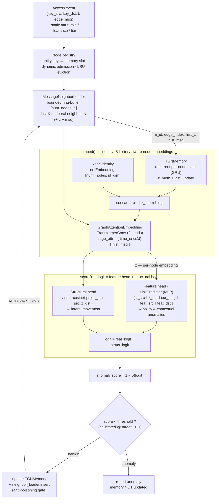

# Graphagate


<br/>


GNN model training and serving microservice (and standalone), specialized in
**unsupervised anomaly detection** for ZTA intrusion detection/prevention systems.

## Overview (Temporal Graph Network)

Graphagate analyzes a continuous, real-time **Zero-Trust access stream** with a
**Temporal Graph Network (TGN)**. Every access (an *IP/device → resource* request) is a
timestamped edge carrying Zero-Trust signals; the model keeps a recurrent **memory** of
each entity's behaviour and a bounded history of its recent **temporal neighbours**, and
scores each new event sequentially.

- **Unsupervised anomaly detection** — trained purely on benign traffic via negative
  sampling. For each benign event the model is pushed towards *benign* and three kinds of
  perturbation towards *anomalous*; the anomaly score is `1 − P(benign)`.
- **Three anomaly classes are detected** — *contextual* (broken TLS trust / sensor
  alerts), *policy* (an entity acting outside its role/clearance/tier), and *lateral
  movement* (an authorised but **non-habitual** access — same edge features as benign,
  detectable only from interaction history).
- **Real-time serving** — `src/serve_tgn.py` exposes the primitives (`load_model`,
  `infer_score`, `update_memory`, `score_event`, `commit_event`) and `src/serve_api.py`
  wraps them in a **REST/JSON inference microservice** (`graphagate.serve_api`, Compose
  profile `serve-tgn`) that a ZTA orchestrator consumes over HTTP. Scoring is
  event-by-event; memory and the neighbour history are updated **only for events
  classified benign** (anti-poisoning gate), and a `NodeRegistry` admits previously unseen
  entities at runtime (dynamic node space). The deployable artifact is
  `public/tgn_checkpoint.pt` (weights + memory + raw-message store + neighbour buffers) and
  `public/tgn_stats.json` (calibrated threshold + registry). Verify with
  `python -m graphagate.verify_tgn`. Integration details (endpoints, OPA anti-poisoning
  flow) in [`docs/orchestrator_integration.md`](docs/orchestrator_integration.md).

## Architettura del modello

Il modello (`src/model/tgn.py`, classe `ZTATemporalGraphNetwork`) combina la memoria
ricorrente del TGN canonico (Rossi et al., 2020) con un **neighbour loader bounded in RAM**
(nessun graph DB) e uno **scorer a due teste** — una basata sulle feature e una di
compatibilità strutturale — che insieme coprono le tre classi di anomalia.



### Componenti e a cosa servono

| Componente (`attributo`) | Ruolo |
|---|---|
| **TGNMemory** (`memory`) | Stato ricorrente per-nodo aggiornato via GRU dai messaggi degli eventi: la "memoria storica" del comportamento di ogni entità. Espone `z_mem` e `last_update` (tempo dell'ultimo aggiornamento, usato per l'encoding temporale relativo). |
| **Node identity** (`node_id`) | Embedding apprendibile per-nodo. Dà a ogni entità — incluse le **risorse**, prive di feature statiche — un'identità distinguibile. È concatenato a `z_mem` **prima** della GNN, così l'embedding di un'entità aggrega *quali* risorse usa abitualmente: senza di esso le risorse sono indistinguibili e il lateral movement non è rilevabile. |
| **Static node features** (`node_feat`) | Attributi statici ZTA per-nodo (ruolo, clearance, device tier), buffer `[num_nodes, 16]`. Forniti per-evento dall'orchestrator/OPA; sono il segnale che separa una violazione di **policy** (stesse feature d'arco del benigno) dal traffico lecito. |
| **MessageNeighborLoader** (`neighbor_loader`) | Ring-buffer **bounded in RAM** (`src/model/neighbor.py`) con gli ultimi `K` vicini temporali per nodo, più il timestamp e il messaggio di ciascun arco. Abilita il message-passing sul vicinato storico — il segnale **strutturale** per il lateral movement — con memoria `O(num_nodes·K·msg_dim)` costante. **Nessun database a grafo.** |
| **GraphAttentionEmbedding** (`gnn`) | `TransformerConv` (2 teste) che calcola l'embedding di nodo `z` attendendo sui vicini temporali; `edge_attr` = encoding del tempo relativo `Δt` concatenato al messaggio storico dell'arco. |
| **Feature head** (`link_pred`, `LinkPredictor`) | MLP su `[z_src, z_dst, messaggio corrente, feat_src, feat_dst]`. Cattura le anomalie **contestuali** (segnali d'arco fuori distribuzione) e di **policy** (via feature statiche). |
| **Structural head** (`struct_proj`, `struct_scale`) | Similarità coseno tra le proiezioni di `z_src` e `z_dst`, scalata da una temperatura apprendibile. Misura se la coppia src↔dst "si appartiene" data la storia: cattura il **lateral movement** (accesso valido ma non-abituale). Sommata alla feature head per formare il logit finale. |
| **NodeRegistry** (`registry`) | Mappa le chiavi-entità esterne → slot di memoria, con **ammissione dinamica** di entità mai viste e **eviction LRU**. Su eviction azzera lo slot in memoria, feature statiche, message store e vicinato. |
| **Calibrazione soglia** | Soglia di decisione calibrata su uno slice benigno held-out al *target FPR* (default 0.05). |
| **Anti-poisoning gate** | Memoria e neighbour loader vengono aggiornati **solo** per eventi classificati benigni → la baseline non viene avvelenata da eventi ostili. |

### Flusso per evento (serving)

1. `NodeRegistry` mappa `key_src`/`key_dst` → slot di memoria (ammette entità nuove).
2. Il neighbour loader espande i due nodi al loro **vicinato temporale storico**
   (`n_id, edge_index, hist_t, hist_msg`).
3. `embed()`: legge la memoria, vi concatena l'identità di nodo e fa girare la GNN sui
   vicini reali → embedding `z` *consapevole di identità e storia*.
4. `score()`: somma la **feature head** e la **structural head** → logit →
   `anomaly score = 1 − σ(logit)`.
5. Se `score < threshold` (benigno): aggiorna `TGNMemory` e inserisce l'arco nel neighbour
   loader (**predict-then-update**); altrimenti l'anomalia è segnalata e la memoria resta
   intatta.

> **Train/serve consistency** — la valutazione offline in `train_tgn.py` riproduce il flusso
> evento-per-evento attraverso esattamente le primitive di serving (`infer_score` /
> `update_memory`), quindi le metriche riportate riflettono il comportamento in produzione.

> **Nota** — l'identità di nodo è *transduttiva*: per le entità note al training fornisce il
> segnale più forte, mentre un'entità mai vista parte da un'identità non addestrata e si
> affida a memoria e vicinato man mano che accumula storia.

## Tipi di anomalia (dati sintetici)

Il generatore (`src/data/stream_synthetic.py`) simula accessi *IP/device → risorsa* e produce,
oltre alle etichette binarie `y`, un vettore `types` per la valutazione per-classe:

| `type` | Classe | Caratteristica | Rilevata da |
|---|---|---|---|
| 0 | benign | accesso abituale e autorizzato | — |
| 1 | policy | ruolo/clearance/tier insufficienti | feature statiche → feature head |
| 2 | contextual | JA3 rotto / alert Snort / sensori | feature d'arco → feature head |
| 3 | lateral | autorizzato ma **non-abituale** | storia/struttura → structural head |

## Usage (Docker)

Tutte le fasi girano via Docker Compose su GPU (CUDA 13, RTX Blackwell). Dettagli in
[`docs/docker.md`](docs/docker.md).

```bash
# Training del modello streaming temporale (TGN)
docker compose --profile training-tgn up

# Verifica della correttezza del serving streaming (richiede gli artifact in public/)
docker compose --profile verify-tgn up

# Servizio di inferenza HTTP long-running (REST/JSON su :8088, per l'orchestrator ZTA)
docker compose --profile serve-tgn up
```

In alternativa, con comandi Docker diretti:

```bash
docker build -f docker/Dockerfile -t graphagate .
docker run --rm --gpus all -v "$PWD/public:/app/public" graphagate                       # train_tgn
docker run --rm --gpus all -v "$PWD/public:/app/public" graphagate graphagate.verify_tgn
```

## Project layout

```
src/config.py                # TGN hyper-parameters and artifact paths
src/data/stream_synthetic.py # streaming mock data generator (policy / contextual / lateral anomalies)
src/model/tgn.py             # TGN architecture: TGNMemory + identity + GNN + dual scorer
src/model/neighbor.py        # MessageNeighborLoader: bounded in-RAM temporal neighbour store
src/model/registry.py        # dynamic NodeRegistry: external entity keys -> memory slots
src/train_tgn.py             # self-supervised training + threshold calibration + per-class eval
src/serve_tgn.py             # serving primitives / persistence (load_model, score_event, commit_event)
src/serve_api.py             # REST/JSON inference microservice (FastAPI) — deployable service
src/verify_tgn.py            # serving-path verification harness
docker/Dockerfile            # GPU image for train_tgn / verify_tgn
public/                      # artifacts: tgn_checkpoint.pt, tgn_stats.json
```

## Integrazione

L'integrazione con l'orchestrator ZTA / Policy Decision Point (OPA) è descritta in
[`docs/orchestrator_integration.md`](docs/orchestrator_integration.md): endpoint HTTP,
schema delle richieste e flusso anti-poisoning con OPA (`/infer` → OPA → `/update`).

Usato come **git submodule**, il servizio si referenzia nel `docker-compose.yml` della
soluzione ZTA puntando al Dockerfile del submodule. Prerequisito: aver prodotto una volta
gli artifact con il profilo `training-tgn` (finiscono in `public/`).

```yaml
  graphagate-inference:
    build:
      context: ./graphagate           # path del submodule
      dockerfile: docker/Dockerfile
    command: ["graphagate.serve_api"] # ENTRYPOINT è ["python","-m"]
    volumes:
      - ./graphagate/public:/app/public   # checkpoint + stats (artifact del training)
    ports:
      - "8088:8088"
    healthcheck:                       # readiness: GET /health
      test: ["CMD", "python", "-c", "import urllib.request,sys; sys.exit(0 if urllib.request.urlopen('http://localhost:8088/health').status==200 else 1)"]
      interval: 30s
      retries: 3
      start_period: 40s
    # GPU opzionale per l'inferenza; un solo container (stato mutabile in RAM).

  orchestrator:
    # ...
    depends_on:
      graphagate-inference:
        condition: service_healthy     # parte solo a modello caricato
```

L'orchestrator chiama gli endpoint via HTTP (`/infer` → OPA → `/update`); esempio di
client Go e variabili d'ambiente in
[`docs/orchestrator_integration.md`](docs/orchestrator_integration.md).
</content>
