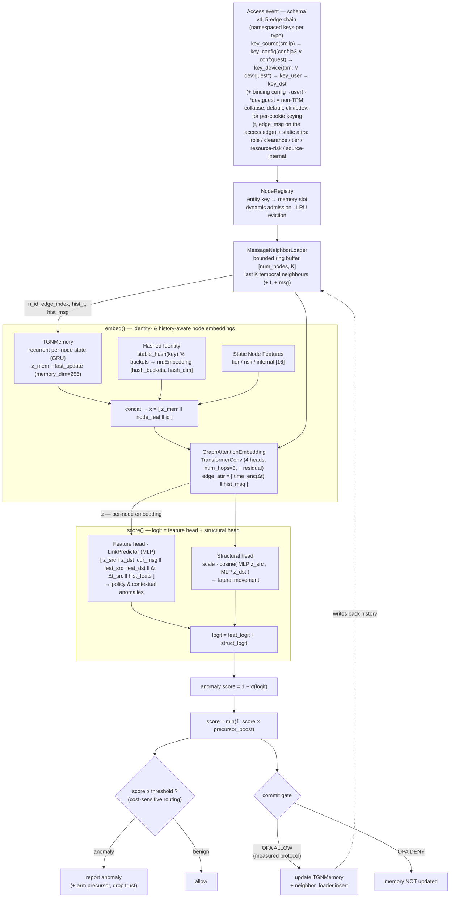

# Graphagate


GNN model training and serving microservice (and standalone), specialized in
**one-class anomaly detection** for ZTA intrusion detection/prevention systems.

## Overview (Temporal Graph Network)

Graphagate analyses a **continuous, real-time Zero-Trust access stream** using a
**Temporal Graph Network (TGN)**. Each access (an *IP/device → resource* request) represents a
temporal edge carrying Zero-Trust signals; the model keeps a recurrent **memory** of the
behaviour of each entity and a bounded history of its recent **temporal neighbours**,
scoring every new event sequentially.

- **One-class anomaly detection** — trained exclusively on benign traffic via negative
  sampling. *Clarification:* the method is **one-class / semi-supervised**, not unsupervised: the
  labels select the training set (benign only) and the primary operating threshold is calibrated
  with lateral-movement labels on the validation slice. No label is ever used to compute a test
  score. See the docstring of `src/train_tgn.py`. For every benign event the model is pushed
  towards *benign* and towards *anomalous* on three kinds of perturbation; the anomaly score is
  computed as `1 − P(benign)`.
- **Detected anomaly classes** — *contextual* (compromised TLS trust / sensor alerts),
  *policy* (an entity acting outside its own role/clearance/tier), *lateral movement* (an
  authorized but **non-habitual** access — same edge features as benign traffic, detectable only
  via the interaction history) and *credential theft* (a never-seen IP **and** device attaching to
  a known user).
- **Real-time serving** — `src/serve_tgn.py` exposes the primitives (`load_model`,
  `infer_score`, `update_memory`, `score_event`, `commit_event`) and `src/serve_api.py`
  wraps them into a **REST/JSON inference microservice** (`graphagate.serve_api`, Compose profile
  `serve-tgn`) queryable over HTTP by a ZTA orchestrator. Scoring happens event by event; the
  memory and the neighbour history are updated **only for events classified as benign**
  (anti-poisoning gate), and a `NodeRegistry` dynamically admits entities never seen before at
  runtime (dynamic node space). The deploy artifacts — **generated** once by the `training-tgn`
  profile (gitignored, not versioned) — are
  `public/tgn_checkpoint.pt` (weights + memory + raw-message store + neighbour buffer) and
  `public/tgn_stats.json` (calibrated threshold + registry). Verification available with
  `python -m graphagate.verify_tgn`. Integration details (endpoints, anti-poisoning OPA flow)
  in [`docs/orchestrator_integration.md`](docs/orchestrator_integration.md).

## Model architecture

The model (`src/model/tgn.py`, class `ZTATemporalGraphNetwork`) combines the recurrent memory
of the canonical TGN (Rossi et al., 2020) with a **bounded-in-RAM neighbour loader**
(no graph DB) and a **two-head scorer** — one feature-based and one structural-compatibility —
which together cover the three anomaly classes.



> **The measured gate is the OPA one, not the model score.** The decision
> (`score ≥ threshold`) and the *commit gate* are two distinct things. In the reported numbers
> the commit happens on the events OPA would admit (proxy: `not signal_dirty`), not on the ones
> the model deems benign — a model that decides for itself what to memorize lets the FPR run
> away (see the docstring of `train_tgn._replay`). The self-decided path exists
> (`score_event(update=True)`, endpoint `/score`) and is the *OPA-less* mode, but it is **not**
> the protocol under which the measurements were produced.

### Components and their role

| Component (`attribute`) | Role |
|---|---|
| **TGNMemory** (`memory`) | Recurrent per-node state updated by a GRU from the event messages: the "historical memory" of each entity's behaviour. Exposes `z_mem` and `last_update`. `memory_dim` was increased to 256 to handle the complex behavioural footprint. |
| **Hashed Identity** (`hash_emb`) | Learnable embedding via deterministic hashing of the key (`stable_hash`, BLAKE2b). Keeps the model 100% inductive for new nodes and gives every entity — including the **resources** — a distinguishable identity. *Honest note:* the ablation delta awaits regeneration (see §Results) — the two series present in the repo contradicted each other and neither had a supporting log. |
| **History features** (`compute_hist_feats`) | For every event `[log1p(pair_count), log1p(src_count), pair/(src+1)]`: causal, *benign-gated* interaction counters (derivable at runtime, not circular). They inject the **novelty** signal of the src→dst pair. The ablation delta awaits regeneration (see §Results). |
| **Kill-chain precursor** (`recent_alert`, `precursor_boost`) | Multiplicative *serving-time* prior that raises an entity's score right after one of its alerts (recon→lateral), with decay `0.5^(Δt/half_life)`. State kept outside the TGN memory (the gate would discard the precursor); **not** a trained input. Ablation delta awaits regeneration (see §Results). |
| **Static node features** (`node_feat`) | Per-node static ZTA attributes, buffer `[num_nodes, 16]`. Indices in use: `[2]` device tier, `[3]` **unused** (it held the resource index: leakage, removed), `[4]` resource **risk** (per-resource sensitivity from the reference policy model), `[5]` source network **internal/external** (RFC1918, derived from the IP — a feature, not a gate), `[14]` trust_score. |
| **MessageNeighborLoader** (`neighbor_loader`) | **Bounded-in-RAM** ring buffer with the last `neighbor_size=30` temporal neighbours per node. Enables message passing over the historical neighbourhood — the **structural** signal for lateral movement — with constant memory `O(num_nodes·K·msg_dim)`. **No graph database.** |
| **GraphAttentionEmbedding** (`gnn`) | Multi-hop (`num_hops=3`) stacks of `TransformerConv` (4 heads, with residual connections) computing the node embedding `z` over the extended temporal neighbourhood; `edge_attr` = encoding of the relative time `Δt` concatenated with the edge's historical message. |
| **Feature head** (`link_pred`, `LinkPredictor`) | MLP over `[z_src, z_dst, cur_msg, feat_src, feat_dst, Δt_enc, history_feats]`. Trained with an **InfoNCE** objective (ranking the true dst above K random ones) + positive anchor BCE + contextual BCE. This is the head that — with memory + history feats — carries the **lateral** signal. |
| **Structural head** (`struct_proj`, `struct_scale`) | Scaled cosine similarity between the projections of `z_src` and `z_dst`. *Honest note:* in earlier measurements it came out marginal — a simplification candidate, to be confirmed with the regenerated ablations. |
| **NodeRegistry** (`registry`) | Maps external entity keys → memory slots, with **dynamic admission** of never-seen entities and **LRU eviction**. On eviction it zeroes the slot's memory, static features, message store and neighbourhood. |
| **Threshold calibration** | Validation replay with **the same gate as the test** (no labels in the gate), in two fixed-point passes. Primary threshold (persisted and used by serving for *signal-clean* events) = **cost-sensitive** (`cost_ratio`=20, `clean_fpr_cap`=0.05): minimizes the FN/FP cost and requires lateral-labelled events in the validation window. A **label-free** variant (quantile on the *signal-clean* benign at target FPR 0.01) is recorded in `calibration["threshold_clean_unsup"]` for deployments without red-team labels. *Signal-dirty* events use the conservative `threshold_dirty` (same FPR target, over the full benign validation slice). |
| **Anti-poisoning gate** | Memory and neighbour loader are updated **only** for the events admitted by the external decider (OPA ALLOW) → the baseline is not poisoned by hostile events. In *OPA-less* mode (`/score`) the gate is the model score itself; it is available but it is not the measured protocol. |

#### Performance and Memory Management (O(1) Lookup)
The "buffer" of the historical memory and of the neighbourhood (`MessageNeighborLoader`) never
incurs *swapping* or slow loads. It consists of large, pre-allocated fixed matrices in RAM
(e.g. `[Total Node Capacity, K]`) from server startup. Every user or IP owns a private "row"
inside these matrices. Upon a request, the system performs a direct (*lookup*) access in
**O(1)** time exclusively to the row of the involved node, updating the events in
ring-buffer mode. The history of the other users is never moved, loaded or altered.

> ⚠️ **Exact scope of the `O(1)` claim / bounded state.** It holds for the **tensor buffers**
> (TGN memory, neighbour ring buffer, static features), which are pre-allocated at
> fixed size. It does **not** hold for the whole model state:
>
> - `last_contact`, `pair_count`, `src_count`, `recent_alert` (`src/model/tgn.py`) are
>   **unbounded** Python dicts: they grow with every never-committed `(src, dst)` pair,
>   are persisted in the checkpoint, and are cleaned only per-slot at eviction.
> - **Eviction is not O(1)**: `NodeRegistry._select_eviction` is a `min` over the whole
>   capacity with a per-element synchronization, `MessageNeighborLoader.reset_node` does an
>   `O(num_nodes × K)` scan to invalidate inbound references, and the dict cleanup is linear in
>   their size.
> - The only latencies measured in the repo are **P50 ≈ 9.81 ms / P99 ≈ 12.33 ms** end-to-end
>   HTTP (cold 10 s run, 665 events, `tasks/runs/serving_client.log` — same source
>   as the paper) — not "fractions of a millisecond". Every request performs 5 neighbourhood
>   expansions and 5 GNN forwards (one per edge of the chain).
>
> This is a known and declared scalability limit: the paper ships on the *vanilla* version.

### Per-event flow (serving)

1. `NodeRegistry` maps `key_user`/`key_device`/`key_source`/`key_dst`/`key_config` → memory slots
   (admitting new entities). The request is the 5-edge chain: `source → config`, `config → device`,
   `config → user`, `device → user` and the access `user → resource`. If a key is missing, the
   corresponding edge is handled via fallback. The final score is the **max over the edges
   present**.
2. The neighbour loader expands the nodes to their **historical temporal neighbourhood**
   (`n_id, edge_index, hist_t, hist_msg`).
3. `embed()`: reads the memory, concatenates the node identity and runs the GNN over the
   real neighbours → `z` embeddings *aware of identity and history*.
4. `score()`: sums the **feature head** and the **structural head** → logit →
   `anomaly score = 1 − σ(logit)`.
5. The external decider (OPA) answers ALLOW/DENY. On **ALLOW**, `TGNMemory` is updated and the
   edge is inserted into the neighbour loader (**predict-then-update**); on DENY the memory stays
   untouched. The model's verdict is reported back (`flagged`) and it arms the kill-chain
   precursor / lowers the trust even when OPA admits the event.

> **Train/serve consistency — verified equivalence, not shared code.** The offline
> evaluation (`train_tgn._replay`) does **not** call the serving primitives: it is a
> vectorized re-implementation that scores a block of events with a single neighbourhood
> expansion. What ties the two paths together is a test: `tests/verify_replay_batching.py`
> replays the same stream event by event through `infer_score` / `update_memory` and verifies
> agreement with `_replay(batch_size=1)` within 1e-5, **on both the 5-edge v4 chain and the
> legacy v3** (measured: `max|Δ| = 2.7e-07`, the value cited in the paper). Earlier revisions
> of this README claimed that the two paths shared code: that was not true, and the harness
> only verified the legacy branch on top of that. The edge topology is identical in both
> paths: a missing device only skips its two edges (config→device, device→user), while
> source→config and config→user remain in both.

> **Note (Hashed Identity)** — the node identity is not *transductive* but generated via
> **deterministic** hashing of the key (`stable_hash`, BLAKE2b): consistent across processes and
> restarts (the builtin `hash()` is salted per-process and would break reproducibility). For
> entities known and unknown to the training it provides a consistent and scalable (bucket)
> embedding, keeping the model fully inductive.

## Anomaly types (synthetic data)

The generator (`src/data/stream_synthetic.py`) simulates the v4 chain *IP → config (JA3) →
device → user → resource* (smart working/roaming, NAT, shared devices, cookie-wipe, never-seen
tools/JA3) and produces, besides the binary labels `y`, a `types` vector for per-class
evaluation and a `scenario` bitmask (roaming / wiped / shared) for per-scenario evaluation:

| `type` | Class | Characteristic | Notes |
|---|---|---|---|
| 0 | benign | habitual **or** authorized non-habitual exploration (`benign_explore_prob`) | — |
| 1 | policy | insufficient role/clearance/tier | **OPA's** (blocked upstream); not added model value |
| 2 | contextual | broken JA3 / Snort alert / sensors | **trivial**: caught ~97% by the rule baseline |
| 3 | lateral | authorized but **non-habitual** | **genuine ML target**: history + temporal memory + kill-chain precursor |
| 4 | credential theft | A different client/tool (config/JA3) than the habitual one reusing the credentials of a known user | **genuine ML target (schema v4)**: visible in particular on the `config → user` binding (policy-clean, signal-clean) |
| 5 | data exfiltration | Massive transfer (high bytes_out) to a sensitive resource | easy and declared signal (by design, continuous); own class to avoid polluting the lateral |
| 6 | benign OPA denial | Human error: access refused by OPA (e.g. write-down) | `label=1` (OPA blocks it) but it is not an attack; the test-client OPA proxy treats it as DENY |

> **De-degeneration.** The benign traffic now sometimes performs *legitimate*
> authorized non-habitual accesses, so the lateral is feature-identical to a non-habitual benign:
> the only discriminator is the **temporal pattern** (recon→lateral). Without this
> (`benign_explore_prob=0`) the task would be the tautology «non-habitual ⟺ lateral».

## Validation (honest results)

> **STATUS: the tables below reproduce the versioned artifacts in `tasks/runs/`**
> (`panelA.json`, `panelB.json`, `leakage_audit_floor.log`, `serving_client.log`) and
> coincide exactly with the paper's numbers (`docs/paper/`). Two open caveats:
>
> 1. **Panel A baseline rows to regenerate.** The `panelA.json` artifacts
>    (2026-08-31) predate the driver parity fix: the four non-TGN baselines (GNN, OC-SVM, IF,
>    XGBoost) generated the stream with a subset of the generator's parameters (missing
>    `num_configs`, `guest_device_fallback`, `use_resource_risk`, `use_source_internal`), i.e. on
>    a different entity space than the TGN's. The driver now uses `stream_kwargs_from_cfg` (a
>    single TGNConfig→generator mapping, shared by TGN, baselines, the live generator and the
>    audit) and the GNN baseline samples negatives over the stream's real resource range: the
>    baseline rows must be regenerated with the `regen-report` profile before the
>    TGN-vs-baseline deltas are cited again.
> 2. **Run-to-run not re-measured.** The dispersion on the *same stream* has not yet been
>    re-measured on the de-leaked generator (see the note at the bottom of this section);
>    the σ reported are over 3 seeds × 1 run.
>
> History of the de-leakage (why the 2026-06 numbers are no longer cited): the
> previous dataset enrichment (1000 procedural resources, Zipf sampling,
> `bytes_*`/`http_status` columns) had introduced shortcuts — the
> `node_feat[dst,3]` column (resource index) alone reached AUC 0.92 on the lateral, and
> four constant-value patterns identified policy/cred-theft/exfil with
> 100% precision and recall. The post-de-leak floor (from `tasks/runs/leakage_audit_floor.log`):
>
> | class | best AUC at **single feature** — before | after |
> |---|---|---|
> | policy | 0.930 | 0.858 *(risk: semantic, declared)* |
> | contextual | 0.926 | 0.899 *(Snort probes: by design)* |
> | **lateral** | **0.920** | **0.603** |
> | cred-theft | 0.941 | 0.725 |
>
> Permanent guard: `pytest tests/test_leakage_audit.py` (CPU, a few seconds) verifies over
> 3 seeds that no input column separates a class alone, that no exact-value fingerprints
> exist, and that benign and lateral share the destination margin. The two
> classes the contribution rests on — **lateral and cred-theft — have no exemption**.

**De-circularised + de-degenerated** evaluation on the synthetic stream (`num_events`=200k,
**3 seeds** `[42,7,123]` — mean ± std. dev, FPR target 1%, chronological split 70/10/20, benign
only in training, threshold calibrated on the benign validation slice). Focus on the **lateral**
(policy is OPA's, contextual is trivial). **All baselines receive the same tabular signals as
the TGN** (edge features, static attributes, causal benign-gated history counters consumed as
a flat tabular vector by the device actor, and the same precursor prior): this way the gap
to the TGN isolates the contribution of the **temporal-relational machinery**, not of the
counters.

| Model (same tabular signals) | Agg AUC | Agg AP | **lateral AUC** | lateral Rec@1%FPR |
|---|---|---|---|---|
| Isolation Forest | 0.592±0.030 | 0.347±0.033 | 0.537±0.023 | 0.9% |
| One-Class SVM | 0.633±0.013 | 0.438±0.016 | 0.469±0.019 | 0.7% |
| Static GNN (graph, **no temporal**) | 0.753±0.004 | 0.674±0.008 | 0.602±0.024 | 13.9% |
| TGN 2-node (user→resource) | 0.854±0.023 | 0.822±0.028 | 0.659±0.024 | 17.0% |
| **TGN (full, v4 deployable)** | **0.853±0.013** | **0.801±0.013** | **0.721±0.011** | **16.1%** |
| _XGBoost (supervised, upper-bound)_ | _0.924±0.008_ | _0.892±0.008_ | _0.783±0.021_ | _20.2%_ |

> ⚠️ **Baseline rows to regenerate.** The values come from `tasks/runs/panelA.json`
> (2026-08-31): the TGN row is under the deployable protocol (dev:guest, v4, 3 seeds), but the
> baseline rows predate the stream parity fix (see the status note at the top): until they are
> regenerated with the corrected driver, the **TGN-vs-baseline deltas in this table are not a
> like-for-like comparison** (the TGN 2-node, which already received the full parameters, is).

> Means over **3 seeds** `[42,7,123]`, std. dev with `ddof=1` (source:
> `tasks/runs/panelA.json`, row by row). _XGBoost_ is **supervised** (it sees the labels):
> a reference upper bound, outside the TGN's one-class paradigm — not a comparable
> baseline. The one-class baselines (IF, OC-SVM) are trained on the benign only; the
> Isolation Forest hyperparameters are selected on the validation AUC (standard compromise of
> the one-class setting, no labels in training).

> **Schema v4 (5 nodes / 5 edges, config/JA3 node — 3 seeds `[42,7,123]`, cost-sensitive
> routed decision).** The *Configuration* node lifts the operational recall on the
> **lateral movement** from the v3 **20.2%** to **48.5%** (**+0.283**, positive on all 3 seeds:
> +0.239/+0.299/+0.312),
> with Lateral AUC **0.608 → 0.777** (**+0.169**) and Agg AUC **0.833 → 0.886**. It improves the
> detection of **credential theft** (Recall **+0.108** vs the ablation without the config node,
> on a *theft-rich* stream). It is not a uniform win: the trade-off is a slightly higher routed
> benign FPR (5.3% → **5.7%**).
>
> **Device identity (deployable).** By default `guest_device_fallback=True`: devices without a
> TPM collapse to a single `dev:guest` node instead of keeping a per-machine cookie identity. On
> the synthetic stream it is a Pareto improvement (lower benign FPR and lower cross-seed
> variance, no false positives from cookie-wipe) without degrading detection; per-cookie keying
> stays switchable (flag off) for per-machine forensic attribution.
>
> **[historical, single-run, PRE-de-leak].** Schema v3 (4 nodes): Lateral AUC ~0.894, Agg AUC ~0.952.
> Schema v2: Lateral AUC ~0.818, Agg AUC ~0.919. Single-seed runs of earlier setups on the
> enriched generator (pre-de-leak, where the JA3 was only a validity bit): not reproducible and
> not comparable with the current numbers; kept only as evolutionary context.

- **The Static GNN — same counters + precursor, same graph structure, but without the
  temporal machinery — stays clearly below the TGN on the lateral (0.602±0.024 vs 0.721±0.011):**
  the aggregated static graph retains a weak residual of habit, but the true lateral signal
  lives in the **recurrent memory + temporal neighbourhood**, not in the counters (which
  everyone has). (Note: the 0.602 is the Panel A value, to be regenerated with the corrected
  baseline — see the status note.)
- ⚠️ **The per-component ablation deltas are RETRACTED pending regeneration** (provenance
  rule: a number without a supporting log is not softened, it is retracted). The
  two series documented earlier contradicted each other on the same quantities and neither
  had a run file behind it. They must be regenerated with `tests/ablations/run_ablations.py`,
  the log saved, and reported as **seed-paired** Δ with a Wilcoxon test and a bootstrap CI
  (`report_metrics.paired_delta`).
- **Recall@1%FPR ~16.1%** stays low (the global threshold is dominated by the easy classes);
  the Static GNN's 13.9% is **spurious** (weak AUC with a permissive threshold, not a robust
  signal). The honest signal is the **multi-seed AUC 0.721±0.011** (≫ chance); the «~40%
  recall» of old pre-de-leak measurements was a circular artifact. The conversion to
  operational recall goes through the cost-sensitive routing (Threshold section): on the
  synthetic test the lateral recall rises to **20.2%** (v3, routed decision, benign FPR 5.3%)
  and to **48.5%** with the config node (v4, FPR 5.7%).

> ⚠️ **Run-to-run variance: to be re-measured (number retracted).** Earlier versions of
> this note cited a run-to-run dispersion of +0.038 lateral AUC / +0.132 recall between
> `tasks/runs/panelB.json` and `tasks/runs/tgn_v*_percookie.log`, presented as
> "same configuration, same seed 42, same stream". **That is not verifiable and the two files
> are on different streams** (n_lateral 3802 vs 3868; the cited "n_benign=14555" was the
> n_benign of the old log's validation slice), and the percookie log is pre-de-leak
> (lateral AUC 0.9324 in the test, against a post-de-leak floor of 0.603): the two artifacts
> are not comparable. For reference, the seed-42 v3→v4 delta *inside* `panelB.json`
> (same stream) is +0.158 lateral AUC / +0.239 routed recall, an order of magnitude
> above the cited values: the number **0.038/0.132 is retracted** and the paper
> (Limitations) no longer reports it. The published σ (3 seeds × 1 run, ddof=1) conflate
> cross-seed and run-to-run variance and understate the error; the ≥5 seeds × 3 replications
> grid on the same stream still has to be run to separate the two variance sources.
>
> Reproducibility: full seeding + deterministic algorithms in `train_tgn`;
> `mean_std` with `ddof=1` (sample standard deviation) in all tables and drivers;
> `paired_delta` with the paired Wilcoxon test + bootstrap CI.

Reproduction: Compose profiles `training-tgn`, `baseline-iforest`, `baseline-ocsvm`,
`baseline-gnn`, `baseline-xgboost`, `ablations`, `config-eval`, `guest-device-eval`,
`arch-sweep`, `eval-lanl`, `verify-tgn`. The panel tables are regenerated (multi-seed)
with the `regen-report` profile; the provenance of every number in the paper is in
`docs/paper/PROVENANCE.md`.

## Limitations and Threat Model

To be read before treating the metrics as production guarantees:

- **External validity.** The published metrics are on **synthetic** streams. In short:
  **no public ZTA dataset exists** and no one ships both user identities and TLS fingerprints
  (survey in the paper, §External Validity). **PicoDomain** is the only corpus in
  which all 5 nodes rest on real fields (`ssl.log` carries `ja3`): harness
  `tests/eval_picodomain.py` + `tests/datasets/picodomain.py`, profile `eval-picodomain`,
  contract verified by `tests/test_picodomain_mapping.py`; measured in a single run
  (agg AUC 0.6658, `tasks/runs/picodomain_eval_docker.log` — the @threshold recall is
  not reported by construction of the split, see `docs/paper/PROVENANCE.md`). There is also a
  **LANL auth** harness (`tests/eval_lanl.py`, profile `eval-lanl`), but there the config node
  degenerates and the credential-theft class **is not evaluable**: it is de facto the ablation
  "without the config node", not a benchmark on equal footing.
- **Self-decided anti-poisoning gate.** Memory/neighbourhood update only for
  *scored* benign events. Inherent consequences: a stealthy attacker scored benign
  **poisons** the baseline; a benign scored anomalous is never learned (**starvation**).
  Mitigation delegated to the orchestrator: OPA as the true decider (`/infer`→`/update`) and a
  short *grace period* for new nodes (see `docs/orchestrator_integration.md`).
- **Unauthenticated endpoints.** `/update`, `/score`, `/persist` have no auth: anyone
  reaching the service can alter the state, bypassing the gate. The design assumes a
  trusted orchestrator on a private network; do not expose the service without TLS +
  authentication.
- **Operational recall of the lateral (not "solved").** The cost-sensitive routing
  (`cost_ratio`=20.0,
  `clean_fpr_cap`=0.05) converts the ranking (lateral AUC ~0.721) into operational recall, but it
  stays limited: on the synthetic test the lateral recall goes from 16.1% (global 1% FPR
  threshold) to 20.2%
  (v3, routed decision, benign FPR 5.3%) and to 48.5% with the config node (v4, FPR 5.7%).
  It is a trade-off tunable via `cost_ratio` / `clean_fpr_cap`, **not** a closed problem.
- **Precursor = heuristic.** The kill-chain prior assumes that the lateral follows a recon that
  triggers Snort on the same IP. It holds in the generator; an attacker avoiding the noisy recon
  bypasses it. It is an honest additive prior, not a guarantee.
- **Cold start.** A new entity without history has no "habits" to deviate from. In our
  stream all laterals land on already-warm entities (`n_cold=0`), so here it is not the
  bottleneck — but in deployment a cold entity is not covered until it accumulates interactions.

## Usage (Docker)

All stages run via Docker Compose on GPU (CUDA 13, RTX Blackwell); the image is
`docker/Dockerfile`, the profiles are in `docker-compose.yml`.

```bash
# Training of the streaming temporal model (TGN)
docker compose --profile training-tgn up

# Verification of the streaming serving correctness (requires the artifacts in public/)
docker compose --profile verify-tgn up

# Long-running HTTP inference service (REST/JSON, host port 8888 → container 8088)
docker compose --profile serve-tgn up
```

Alternatively, with direct Docker commands:

```bash
docker build -f docker/Dockerfile -t graphagate .
docker run --rm --gpus all -v "$PWD/public:/app/public" graphagate                       # train_tgn
docker run --rm --gpus all -v "$PWD/public:/app/public" graphagate graphagate.verify_tgn
```

## Scientific Paper Compilation

The academic manuscript in IEEEtran format (`docs/paper/main.tex`) can be compiled automatically
through the dedicated scripts in `scripts/`, which detect the installed LaTeX engine
(`pdflatex`, `latexmk`, `xelatex`, `lualatex`, `tectonic` or the Docker `texlive/texlive`
fallback), resolve the bibliography with BibTeX and remove the intermediate build files.

### From PowerShell (Windows)

```powershell
# Automatic compilation + cleanup of intermediate files (.aux, .log, .bbl, etc.)
.\scripts\build_paper.ps1

# To force a specific engine (e.g. pdflatex) or keep the intermediate files
.\scripts\build_paper.ps1 -Engine pdflatex -KeepAux

# Cleanup of the temporary files only
.\scripts\build_paper.ps1 -CleanOnly
```

### From Bash (Linux / macOS / WSL)

```bash
# Make the script executable (first time)
chmod +x ./scripts/build_paper.sh

# Automatic compilation + cleanup
./scripts/build_paper.sh

# To force a specific engine or keep the intermediate files
./scripts/build_paper.sh --engine pdflatex --keep-aux

# Cleanup of the temporary files only
./scripts/build_paper.sh --clean-only
```

The final generated PDF is saved directly to `docs/paper/main.pdf`.

## Project layout

```
docs/paper/                  # IEEEtran academic manuscript (main.tex, results.tex, refs.bib)
scripts/                     # Utility and build scripts (build_paper.ps1, build_paper.sh)
src/config.py                # TGN hyper-parameters and artifact paths
src/data/stream_synthetic.py # streaming mock data generator (policy / contextual / lateral anomalies)
src/model/tgn.py             # TGN architecture: TGNMemory + identity + GNN + dual scorer
src/model/neighbor.py        # MessageNeighborLoader: bounded in-RAM temporal neighbour store
src/model/registry.py        # dynamic NodeRegistry: external entity keys -> memory slots
src/train_tgn.py             # self-supervised training + threshold calibration + per-class eval
src/serve_tgn.py             # serving primitives / persistence (load_model, score_event, commit_event)
src/serve_api.py             # REST/JSON inference microservice (FastAPI) — deployable service
src/verify_tgn.py            # serving-path verification harness
docker/Dockerfile            # GPU image for train_tgn / verify_tgn
public/                      # artifacts generated by the training-tgn profile (gitignored):
                               #   tgn_checkpoint.pt, tgn_stats.json
```

## Integration

The integration with the ZTA orchestrator / Policy Decision Point (OPA) is described in
[`docs/orchestrator_integration.md`](docs/orchestrator_integration.md): HTTP endpoints,
request schema and the anti-poisoning flow with OPA (`/infer` → OPA → `/update`).

Used as a **git submodule**, the service is referenced in the ZTA solution's `docker-compose.yml`
by pointing at the submodule's Dockerfile. Prerequisite: having produced the artifacts once
with the `training-tgn` profile (they land in `public/`).

```yaml
  graphagate-inference:
    build:
      context: ./graphagate           # submodule path
      dockerfile: docker/Dockerfile
    command: ["graphagate.serve_api"] # ENTRYPOINT is ["python","-m"]
    volumes:
      - ./graphagate/public:/app/public   # checkpoint + stats (training artifacts)
    ports:
      - "8888:8088"                     # host 8888 (as in the repo docker-compose.yml) -> container 8088
    healthcheck:                       # readiness: GET /health (503 while the model loads)
      test: ["CMD", "python", "-c", "import urllib.request,sys; sys.exit(0 if urllib.request.urlopen('http://localhost:8088/health').status==200 else 1)"]
      interval: 30s
      retries: 3
      start_period: 40s
    # Optional GPU for inference; a single container (mutable state in RAM).

  orchestrator:
    # ...
    depends_on:
      graphagate-inference:
        condition: service_healthy     # starts only once the model is loaded
```

The orchestrator calls the endpoints over HTTP (`/infer` → OPA → `/update`); a Go client
example and the environment variables are in
[`docs/orchestrator_integration.md`](docs/orchestrator_integration.md).
