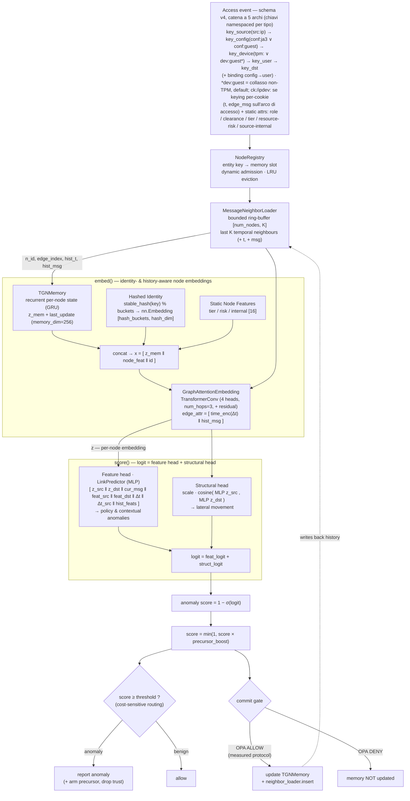

# Graphagate


GNN model training and serving microservice (and standalone), specialized in
**one-class anomaly detection** for ZTA intrusion detection/prevention systems.

## Overview (Temporal Graph Network)

Graphagate analizza un **flusso di accessi Zero-Trust** continuo e in tempo reale utilizzando una
**Temporal Graph Network (TGN)**. Ogni accesso (una richiesta *IP/device → risorsa*) rappresenta un
arco temporale (edge) contenente segnali Zero-Trust; il modello mantiene una **memoria** ricorrente del
comportamento di ciascuna entità e una cronologia limitata dei suoi **vicini temporali** recenti,
assegnando uno score a ogni nuovo evento in modo sequenziale.

- **One-class anomaly detection** — addestrato esclusivamente su traffico benigno tramite negative
  sampling. *Precisazione:* il metodo è **one-class / semi-supervised**, non unsupervised: le label
  selezionano il training set (solo benigno) e la soglia operativa primaria è calibrata con label
  di lateral movement sullo slice di validazione. Nessuna label è mai usata per calcolare uno score
  di test. Vedi il docstring di `src/train_tgn.py`. Per ogni evento benigno il modello viene spinto verso *benigno* e su tre tipi di
  perturbazione verso *anomalo*; lo score di anomalia è calcolato come `1 − P(benign)`.
- **Classi di anomalie rilevate** — *contestuale* (fiducia TLS compromessa / allarmi
  dai sensori), *policy* (un'entità che agisce al di fuori del proprio ruolo/clearance/tier), *movimento
  laterale* (un accesso autorizzato ma **non abituale** — stesse feature d'arco del traffico benigno,
  rilevabile esclusivamente tramite lo storico delle interazioni) e *credential theft* (IP **e** device
  mai visti che si agganciano a un utente noto).
- **Serving in tempo reale** — `src/serve_tgn.py` espone le primitive (`load_model`,
  `infer_score`, `update_memory`, `score_event`, `commit_event`) e `src/serve_api.py`
  le incapsula in un **microservizio di inferenza REST/JSON** (`graphagate.serve_api`, profilo Compose
  `serve-tgn`) interrogabile da un orchestrator ZTA tramite HTTP. Il calcolo dello score avviene
  evento per evento; la memoria e lo storico del vicinato vengono aggiornati **solo per gli eventi
  classificati come benigni** (anti-poisoning gate), e un `NodeRegistry` ammette dinamicamente
  entità mai viste prima a runtime (spazio dei nodi dinamico). Gli artifact per il deploy sono
  `public/tgn_checkpoint.pt` (pesi + memoria + raw-message store + buffer del vicinato) e
  `public/tgn_stats.json` (soglia calibrata + registro). Verifica disponibile con
  `python -m graphagate.verify_tgn`. Dettagli sull'integrazione (endpoint, flusso anti-poisoning OPA)
  in [`docs/orchestrator_integration.md`](docs/orchestrator_integration.md).

## Architettura del modello

Il modello (`src/model/tgn.py`, classe `ZTATemporalGraphNetwork`) combina la memoria
ricorrente del TGN canonico (Rossi et al., 2020) con un **neighbour loader bounded in RAM**
(nessun graph DB) e uno **scorer a due teste** — una basata sulle feature e una di
compatibilità strutturale — che insieme coprono le tre classi di anomalia.



> **Il gate misurato è quello di OPA, non lo score del modello.** La decisione
> (`score ≥ threshold`) e il *commit gate* sono due cose distinte. Nei numeri riportati il
> commit avviene sugli eventi che OPA ammetterebbe (proxy: `not signal_dirty`), non su quelli
> che il modello ritiene benigni — un modello che si auto-decide cosa memorizzare fa correre
> via l'FPR (vedi il docstring di `train_tgn._replay`). Il percorso auto-deciso esiste
> (`score_event(update=True)`, endpoint `/score`) ed è la modalità *OPA-less*, ma **non** è il
> protocollo con cui sono state prodotte le misure.

### Componenti e a cosa servono

| Componente (`attributo`) | Ruolo |
|---|---|
| **TGNMemory** (`memory`) | Stato ricorrente per-nodo aggiornato via GRU dai messaggi degli eventi: la "memoria storica" del comportamento di ogni entità. Espone `z_mem` e `last_update`. `memory_dim` è stata aumentata a 256 per gestire l'impronta comportamentale complessa. |
| **Hashed Identity** (`hash_emb`) | Embedding apprendibile via hashing deterministico della chiave (`stable_hash`, BLAKE2b). Mantiene induttività al 100% per i nodi nuovi e dà a ogni entità — incluse le **risorse** — un'identità distinguibile. *Nota onesta:* il delta di ablation è in attesa di rigenerazione (vedi §risultati) — le due serie presenti nel repo si contraddicevano e nessuna aveva un log a supporto. |
| **History features** (`compute_hist_feats`) | Per ogni evento `[log1p(pair_count), log1p(src_count), pair/(src+1)]`: contatori d'interazione causali e *benign-gated* (derivabili a runtime, non circolari). Iniettano il segnale di **novità** della coppia src→dst. Il delta di ablation è in attesa di rigenerazione (vedi §risultati). |
| **Kill-chain precursor** (`recent_alert`, `precursor_boost`) | Prior moltiplicativo *serving-time* che alza lo score di un'entità subito dopo un suo alert (recon→lateral), con decadimento `0.5^(Δt/half_life)`. Stato fuori dalla memoria TGN (il gate scarterebbe il precursore); **non** è un input addestrato. Delta di ablation in attesa di rigenerazione (vedi §risultati). |
| **Static node features** (`node_feat`) | Attributi statici ZTA per-nodo, buffer `[num_nodes, 16]`. Indici usati: `[2]` device tier, `[3]` **inutilizzato** (conteneva l'indice risorsa: leakage, rimosso), `[4]` resource **risk** (mirror di `getResourceSensitivity`/`matrice_sicurezza`), `[5]` source network **internal/external** (RFC1918, derivato dall'IP — feature, non gate), `[14]` trust_score. |
| **MessageNeighborLoader** (`neighbor_loader`) | Ring-buffer **bounded in RAM** con gli ultimi `neighbor_size=30` vicini temporali per nodo. Abilita il message-passing sul vicinato storico — il segnale **strutturale** per il lateral movement — con memoria `O(num_nodes·K·msg_dim)` costante. **Nessun database a grafo.** |
| **GraphAttentionEmbedding** (`gnn`) | Reti multi-hop (`num_hops=3`) di `TransformerConv` (4 teste, con connessioni residuali) che calcolano l'embedding di nodo `z` attendendo sui vicini temporali estesi; `edge_attr` = encoding del tempo relativo `Δt` concatenato al messaggio storico dell'arco. |
| **Feature head** (`link_pred`, `LinkPredictor`) | MLP su `[z_src, z_dst, cur_msg, feat_src, feat_dst, Δt_enc, history_feats]`. Allenata con un obiettivo **InfoNCE** (ranking della dst vera sopra K casuali) + ancora BCE positiva + BCE contestuale. È la testa che — con memoria + history feats — porta il segnale **lateral**. |
| **Structural head** (`struct_proj`, `struct_scale`) | Similarità coseno scalata tra le proiezioni di `z_src` e `z_dst`. *Nota onesta:* nelle misure precedenti risultava marginale — candidata a semplificazione, da confermare con le ablation rigenerate. |
| **NodeRegistry** (`registry`) | Mappa le chiavi-entità esterne → slot di memoria, con **ammissione dinamica** di entità mai viste e **eviction LRU**. Su eviction azzera lo slot in memoria, feature statiche, message store e vicinato. |
| **Calibrazione soglia** | Replay di validazione con **lo stesso gate del test** (nessuna label nel gate), in due passate a punto fisso. Soglia primaria = quantile sul benigno *signal-clean* al *target FPR* (default 0.01), **label-free**. La soglia cost-sensitive (`clean_fpr_cap`=0.05) resta riportata come **upper bound dichiarato**: richiede eventi lateral etichettati nella finestra di validazione. |
| **Anti-poisoning gate** | Memoria e neighbour loader vengono aggiornati **solo** per gli eventi ammessi dal decisore esterno (OPA ALLOW) → la baseline non viene avvelenata da eventi ostili. Nella modalità *OPA-less* (`/score`) il gate è lo score del modello stesso; è disponibile ma non è il protocollo misurato. |

#### Performance e Gestione Memoria (O(1) Lookup)
Il "buffer" della memoria storica e del vicinato (`MessageNeighborLoader`) non comporta mai *swapping* o caricamenti lenti. È costituito da grosse matrici pre-allocate fisse in RAM (es. `[Capacità Totale Nodi, K]`) fin dall'avvio del server. Ogni utente o IP possiede una sua "riga" privata all'interno di queste matrici. All'arrivo di una richiesta, il sistema esegue un accesso diretto (*lookup*) in tempo **O(1)** esclusivamente alla riga del nodo coinvolto, aggiornando gli eventi in modalità ring-buffer. La storia degli altri utenti non viene spostata, caricata o alterata.

> ⚠️ **Portata esatta del claim `O(1)` / stato limitato.** Vale per i **buffer tensoriali**
> (memoria TGN, ring-buffer del vicinato, feature statiche), che sono pre-allocati a
> dimensione fissa. **Non** vale per l'intero stato del modello:
>
> - `last_contact`, `pair_count`, `src_count`, `recent_alert` (`src/model/tgn.py`) sono
>   dizionari Python **non limitati**: crescono con ogni coppia `(src, dst)` mai committata,
>   vengono persistiti nel checkpoint e sono ripuliti solo per-slot in eviction.
> - L'**eviction non è O(1)**: `NodeRegistry._select_eviction` è un `min` su tutta la
>   capacity con una sincronizzazione per elemento, `MessageNeighborLoader.reset_node` fa una
>   scansione `O(num_nodes × K)` per invalidare i riferimenti entranti, e la ripulitura dei
>   dizionari è lineare nella loro dimensione.
> - Le uniche latenze misurate nel repo sono **P50 ≈ 9.6 ms / P99 ≈ 10.8 ms** end-to-end HTTP
>   (`docs/latex/report.tex`) — non "frazioni di millisecondo", e comunque non riprodotte da
>   un log versionato. Ogni richiesta esegue 5 espansioni del vicinato e 5 forward del GNN
>   (uno per arco della catena).
>
> È un limite di scalabilità noto e dichiarato: il paper esce sulla versione *vanilla*.

### Flusso per evento (serving)

1. `NodeRegistry` mappa `key_user`/`key_device`/`key_source`/`key_dst`/`key_config` → slot di memoria
   (ammette entità nuove). La richiesta è la catena a 5 archi: `source → config`, `config → device`,
   `config → user`, `device → user` e l'accesso `user → resource`. Se una chiave manca, l'arco
   relativo viene gestito via fallback. Lo score finale è il **max sugli archi presenti**.
2. Il neighbour loader espande i nodi al loro **vicinato temporale storico**
   (`n_id, edge_index, hist_t, hist_msg`).
3. `embed()`: legge la memoria, vi concatena l'identità di nodo e fa girare la GNN sui
   vicini reali → embedding `z` *consapevole di identità e storia*.
4. `score()`: somma la **feature head** e la **structural head** → logit →
   `anomaly score = 1 − σ(logit)`.
5. Il decisore esterno (OPA) risponde ALLOW/DENY. Su **ALLOW** si aggiorna `TGNMemory` e si
   inserisce l'arco nel neighbour loader (**predict-then-update**); su DENY la memoria resta
   intatta. Il verdetto del modello viene riportato indietro (`flagged`) e arma il precursore
   kill-chain / abbassa il trust anche quando OPA ammette l'evento.

> **Train/serve consistency — equivalenza verificata, non codice condiviso.** La valutazione
> offline (`train_tgn._replay`) **non** chiama le primitive di serving: è una
> re-implementazione vettorizzata che valuta un blocco di eventi con una sola espansione del
> vicinato. Ciò che lega i due percorsi è un test: `tests/verify_replay_batching.py` rigioca
> lo stesso stream evento per evento attraverso `infer_score` / `update_memory` e verifica
> l'accordo con `_replay(batch_size=1)` entro 1e-5, **sia sulla catena v4 a 5 archi sia sulla
> legacy v3** (misurato: `max|Δ| = 3.1e-07`). Revisioni precedenti di questo README
> affermavano che i due path condividessero il codice: non era vero, e l'harness verificava
> per giunta solo il ramo legacy.

> **Nota (Hashed Identity)** — l'identità di nodo non è *transduttiva*, bensì generata tramite hashing **deterministico** della chiave (`stable_hash`, BLAKE2b): coerente tra processi e riavvii (il `hash()` builtin è salato per-processo e romperebbe la riproducibilità). Per entità note e non note al training fornisce un embedding coerente e scalabile (bucket), mantenendo il modello totalmente induttivo.

## Tipi di anomalia (dati sintetici)

Il generatore (`src/data/stream_synthetic.py`) simula la catena v4 *IP → config (JA3) → device →
utente → risorsa* (smart working/roaming, NAT, device condivisi, cookie-wipe, tool/JA3 mai visti)
e produce, oltre alle
etichette binarie `y`, un vettore `types` per la valutazione per-classe e un bitmask
`scenario` (roaming / wiped / shared) per la valutazione per-scenario:

| `type` | Classe | Caratteristica | Note |
|---|---|---|---|
| 0 | benign | abituale **o** esplorazione autorizzata-non-abituale (`benign_explore_prob`) | — |
| 1 | policy | ruolo/clearance/tier insufficienti | **di OPA** (bloccato a monte); non valore aggiunto del modello |
| 2 | contextual | JA3 rotto / alert Snort / sensori | **banale**: presa al ~97% dalla rule baseline |
| 3 | lateral | autorizzato ma **non-abituale** | **target ML genuino**: storia + memoria temporale + precursor kill-chain |
| 4 | credential theft | Un client/tool (config/JA3) diverso da quello abituale che riusa credenziali di un utente noto | **target ML genuino (schema v4)**: visibile in particolare sul binding `config → user` (policy-clean, signal-clean) |

> **De-degenerazione.** Il benigno ora compie a volte accessi autorizzati-non-abituali
> *legittimi*, quindi il lateral è feature-identico a un benigno non-abituale: l'unico
> discriminante è il **pattern temporale** (recon→lateral). Senza questo (`benign_explore_prob=0`)
> il task sarebbe la tautologia «non-abituale ⟺ lateral». Vedi `docs/inductive_testing.md`.

## Validazione (risultati onesti)

> 🔴 **STATO: le tabelle qui sotto NON sono riproducibili da HEAD e vanno rigenerate.**
>
> Il generatore è stato **de-leakato**. La revisione pre-submission ha misurato che
> l'arricchimento del dataset ("Phase 2": 1000 risorse procedurali, campionamento Zipf,
> colonne `bytes_*`/`http_status`) aveva introdotto scorciatoie che rendevano il task
> banale:
>
> | classe | best AUC a **feature singola** — prima | dopo |
> |---|---|---|
> | policy | 0.930 | 0.859 *(risk: semantico, dichiarato)* |
> | contextual | 0.926 | 0.898 *(sonde Snort: by design)* |
> | **lateral** | **0.920** | **0.567** |
> | cred-theft | 0.941 | 0.730 |
>
> La causa principale: `node_feat[dst, 3]` conteneva l'indice risorsa, e poiché il benigno
> si concentrava sulle risorse popolari (= indici bassi) mentre gli attacchi campionavano
> uniforme, **quella singola colonna raggiungeva da sola AUC 0.92 su ogni classe** — cioè
> quanto l'AUC lateral riportata dal modello. In più, quattro pattern a valore costante
> (`http_status==0.4`, `bytes==(0.1,0.1)`, `bytes_out==15.0`, `bytes==(0.2,0.5)`)
> identificavano policy, cred-theft, exfil e i service account benigni con **precision e
> recall del 100%**.
>
> **Le tabelle attuali precedono questo problema** (generate il 2026-06-24, prima
> dell'arricchimento): sul generatore di allora `AUC(node_feat[dst,3])` sul lateral era
> **0.4899**, cioè caso — il valore riportato è genuinamente guadagnato dal modello. Ma
> quel generatore non esiste più, quindi i numeri **non sono riproducibili da HEAD** e vanno
> rifatti sul dataset corretto.
>
> Presidio permanente: `pytest tests/test_leakage_audit.py` (CPU, pochi secondi) verifica su
> 3 seed che nessuna colonna d'input separi una classe da sola, che non esistano fingerprint
> a valore esatto, e che benigno e lateral condividano la marginale di destinazione. Le due
> classi su cui poggia il contributo — **lateral e cred-theft — non hanno alcuna deroga**.

Valutazione **de-circolarizzata + de-degenerata** sullo stream sintetico (`num_events`=200k,
**3 seed** `[42,7,123]` — media ± dev.std, FPR target 1%, split cronologico 70/10/20, solo benigno
in training, soglia calibrata sul benigno di validazione). Focus sul **lateral** (policy è di OPA,
contextual è banale). **Tutte le baseline ricevono gli stessi segnali tabellari del TGN** (feature
di storia causali + lo stesso prior precursor): così il divario col TGN isola il contributo della
**macchina temporale-relazionale**, non dei contatori.

| Modello (stessi segnali tabellari) | Agg AUC | Agg AP | **lateral AUC** | lateral Rec@1%FPR |
|---|---|---|---|---|
| Isolation Forest | 0.763 | 0.575 | 0.645 | 0.9% |
| One-Class SVM | 0.801 | 0.739 | 0.599 | 6.2% |
| Static GNN (grafo, **no temporale**) | 0.555 | 0.560 | 0.451 ≈ caso | 12.5% (spurio) |
| **TGN (full, v3 per-cookie)** ⚠️ | **0.965** | **0.922** | **0.913** | **16.6%** |
| _XGBoost (supervisionato, upper-bound)_ | _0.974_ | _0.948_ | _0.929_ | _33.9%_ |

> ⚠️ **Protocollo misto, da rigenerare.** In questa tabella la riga TGN proviene da run
> **v3 per-cookie**, mentre tutte le baseline girano *deployable* (`dev:guest`, v4): righe
> prodotte sotto due configurazioni diverse, presentate come confronto. Il driver è stato
> corretto (`run_panel_a_tgn` esegue ora anche il TGN sotto il protocollo delle baseline),
> ma i numeri qui sopra sono i vecchi — vanno rigenerati insieme al resto.

> Medie su **3 seed**; dispersione (± dev.std) nella relazione tecnica (`docs/latex/report.tex`,
> tab. baseline). _XGBoost_ è **supervisionato** (vede le label): upper-bound di riferimento, fuori
> dal paradigma non supervisionato del TGN — non una baseline comparabile.

> **Schema v4 (5 nodi / 5 archi, nodo config/JA3 — 3 seed `[42,7,123]`, decisione cost-sensitive
> instradata).** Il nodo *Configuration* alza il recall operativo sul **lateral movement** dal ~35.0%
> del v3 al **~57.7%** (**+0.227**, oltre il rumore multi-seed), con Lateral AUC **0.913 → 0.930** e
> Agg AUC ~invariata (**0.965 → 0.964**). Migliora la rilevazione del **credential theft** (Recall
> **+0.108** vs l'ablazione senza nodo config, su stream *theft-rich*). Non è un dominio uniforme: il
> trade-off è un FPR benigno instradato più alto (~5.0% → **~6.6%**). Tabelle complete e validazioni
> mirate nella relazione tecnica (`docs/latex/report.tex`).
>
> **Identità del device (deployable).** Di default `guest_device_fallback=True`: i dispositivi senza
> TPM collassano su un unico nodo `dev:guest` anziché tenere un'identità-cookie per macchina. Sullo
> stream sintetico è un miglioramento di Pareto (FPR benigno e varianza tra seed più bassi, niente
> falsi positivi da cookie-wipe) senza degradare la detection; il keying per-cookie resta attivabile
> (flag off) per l'attribuzione forense per-macchina.
>
> **[storico, single-run].** Schema v3 (4 nodi): Lateral AUC ~0.894, Agg AUC ~0.952. Schema v2:
> Lateral AUC ~0.818, Agg AUC ~0.919. Run single-seed di setup precedenti (lo schema a 4 nodi usava
> il JA3 solo come bit di validità, mascherando tool nuovi su device noti e furti di credenziali da
> client differenti), mantenuti solo come contesto evolutivo; i numeri correnti in tabella sono
> multi-seed e differiscono di conseguenza.

- **Lo Static GNN — stessi contatori + precursor, stessa struttura di grafo, ma senza la
  macchina temporale — sta a caso sul lateral (0.451).** Il TGN arriva a **0.913±0.014**
  (3 seed): il segnale laterale vive nella **memoria ricorrente + vicinato temporale**, non nei
  contatori (che tutti hanno).
- ⚠️ **I delta di ablation per componente sono RITIRATI in attesa di rigenerazione.** Le due
  serie presenti nel repo si contraddicevano sulle stesse grandezze — README dava history
  **+0.163** / hash **+0.046** / precursor **+0.013** / struct **+0.007**, mentre
  `docs/lateral_movement.md` e `docs/inductive_testing.md` davano history **+0.066** /
  precursor **+0.073** / hash **−0.003** / struct **−0.008** — e **nessuna delle due ha un
  log a supporto** (`docs/latex/PROVENANCE.md` indica come sorgente "stdout"; non esiste
  nessun file di ablation in `tasks/runs/`). Vanno rigenerate con
  `tests/ablations/run_ablations.py`, log salvato, e riportate come Δ **appaiati per seed**
  con test di Wilcoxon e CI bootstrap (`report_metrics.paired_delta`). Vedi anche la nota
  sulla varianza run-to-run più sotto.
- **Recall@1%FPR ~16.6%** resta basso (la soglia globale è dominata dalle classi facili); il 12.5%
  della Static GNN è **spurio** (AUC≈caso con soglia permissiva, non un segnale reale). Il segnale
  onesto è l'**AUC 0.913 multi-seed** (≫ caso); il «~40% recall» di vecchie misure era un artefatto
  circolare. La conversione in recall operativo passa per il routing cost-sensitive (Sez. soglia):
  sul test sintetico il recall laterale sale a ~35.0% (FPR benigno ~5.0%), e a ~57.7% con il nodo
  config (v4).

> ⚠️ **Le barre d'errore pubblicate sottostimano la varianza reale — da rigenerare.**
> Due run della **stessa** configurazione e dello **stesso** seed 42 (`tasks/runs/panelB.json`
> vs `tasks/runs/tgn_v*_percookie.log`; stesso stream, `n_lateral=3868` e `n_benign=14555`
> identici) differiscono di **+0.038 di AUC lateral** e **+0.132 di recall lateral**. Le
> dispersioni riportate (±0.013÷0.014 su AUC, ±0.034÷0.057 su recall) provengono da 3 seed ×
> **1 run ciascuno**, quindi confondono varianza tra-seed e varianza run-to-run e
> **sottostimano** l'errore. Conseguenza diretta: il Δ titolare **+0.017 di lateral AUC**
> v3→v4 è dentro il rumore e non è al momento stabilito (il Δ di recall **+0.227** è molto
> più grande e probabilmente sopravvive, ma va ri-misurato).
>
> Correzioni già applicate: seeding completo + algoritmi deterministici in `train_tgn`,
> `mean_std` con `ddof=1` (le σ pubblicate erano ~18% troppo strette), e `paired_delta` con
> Wilcoxon appaiato + CI bootstrap al posto della regola `|Δ| > max(σ)`, che non era un test.
> Resta da eseguire la griglia a ≥5 seed × 3 repliche.

Dettagli su de-circolarizzazione, de-degenerazione, ablation multi-seed, cold-start e
anti-poisoning in 👉 [`docs/inductive_testing.md`](docs/inductive_testing.md) e
[`docs/lateral_movement.md`](docs/lateral_movement.md). Riproduzione: profili Compose
`training-tgn`, `baseline-iforest`, `baseline-ocsvm`, `baseline-gnn`, `baseline-xgboost`,
`ablations`, `config-eval`, `guest-device-eval`, `arch-sweep`, `eval-lanl`, `verify-tgn`. Le
tabelle della relazione tecnica si rigenerano (multi-seed) col profilo `regen-report`.

## Limitazioni e Threat Model

Da leggere prima di trattare le metriche come garanzie di produzione:

- **Validità esterna.** Le metriche pubblicate sono su stream **sintetico**. Selezione dei
  dataset reali e mapping campo-per-campo sulla catena a 5 nodi in
  👉 [`docs/datasets.md`](docs/datasets.md). In sintesi: **nessun dataset ZTA pubblico
  esiste** e nessuno consegna insieme identità utente e fingerprint TLS. **PicoDomain** è
  l'unico corpus in cui tutti e 5 i nodi poggiano su campi reali (`ssl.log` porta `ja3`):
  harness `tests/eval_picodomain.py` + `tests/datasets/picodomain.py`, profilo
  `eval-picodomain`, contratto verificato da `tests/test_picodomain_mapping.py`. Esiste anche
  un harness su **LANL auth** (`tests/eval_lanl.py`, profilo `eval-lanl`), ma lì il nodo config
  degenera e la classe credential-theft **non è valutabile**: è di fatto l'ablazione «senza
  nodo config», non un benchmark alla pari. Nessuno dei due ha ancora risultati
  publication-grade.
- **Anti-poisoning gate auto-deciso.** Memoria/vicinato si aggiornano solo per eventi
  *scorati* benigni. Conseguenze intrinseche: un attaccante stealthy scorato benigno
  **avvelena** la baseline; un benigno scorato anomalo non viene mai appreso (**starvation**).
  Mitigazione demandata all'orchestrator: OPA come vero decisore (`/infer`→`/update`) e un
  *grace period* breve per i nuovi nodi (vedi `docs/orchestrator_integration.md`).
- **Endpoint non autenticati.** `/update`, `/score`, `/persist` non hanno auth: chiunque
  raggiunga il servizio può alterare lo stato, bypassando il gate. Il design assume un
  orchestrator fidato su rete privata; non esporre il servizio senza TLS + autenticazione.
- **Recall operativo del lateral (non "risolto").** Il routing cost-sensitive (`cost_ratio`=20.0,
  `clean_fpr_cap`=0.05) converte il ranking (lateral AUC ~0.913) in recall operativo, ma resta
  limitato: sul test sintetico il recall laterale passa da ~16.6% (soglia globale 1% FPR) a ~35.0%
  (v3, decisione instradata, FPR benigno ~5.0%) e fino a ~57.7% con il nodo config (v4, FPR ~6.6%).
  È un trade-off regolabile via `cost_ratio` / `clean_fpr_cap`, **non** un problema chiuso.
- **Precursor = euristica.** Il prior kill-chain assume che il lateral segua un recon che fa
  scattare Snort sullo stesso IP. Regge nel generatore; un attaccante che evita il recon rumoroso
  lo aggira. È un prior additivo onesto, non una garanzia.
- **Cold start.** Una nuova entità senza storia non ha «abitudini» da cui deviare. Nel nostro
  stream tutti i laterali cadono su entità già calde (`n_cold=0`), quindi qui non è il collo di
  bottiglia — ma in deployment un'entità fredda non è coperta finché non accumula interazioni.

## Usage (Docker)

Tutte le fasi girano via Docker Compose su GPU (CUDA 13, RTX Blackwell). Dettagli in
[`docs/docker.md`](docs/docker.md).

```bash
# Training del modello streaming temporale (TGN)
docker compose --profile training-tgn up

# Verifica della correttezza del serving streaming (richiede gli artifact in public/)
docker compose --profile verify-tgn up

# Servizio di inferenza HTTP long-running (REST/JSON su :8088, per l'orchestrator ZTA)
docker compose --profile serve-tgn up
```

In alternativa, con comandi Docker diretti:

```bash
docker build -f docker/Dockerfile -t graphagate .
docker run --rm --gpus all -v "$PWD/public:/app/public" graphagate                       # train_tgn
docker run --rm --gpus all -v "$PWD/public:/app/public" graphagate graphagate.verify_tgn
```

## Compilazione del Paper Scientifico

Il manoscritto accademico in formato IEEEtran (`docs/paper/main.tex`) può essere compilato automaticamente tramite gli script dedicati in `scripts/`, che rilevano il motore LaTeX installato (`pdflatex`, `latexmk`, `xelatex`, `lualatex`, `tectonic` o fallback Docker `texlive/texlive`), risolvono la bibliografia con BibTeX e rimuovono i file intermedi di build.

### Da PowerShell (Windows)

```powershell
# Compilazione automatica + pulizia dei file intermedi (.aux, .log, .bbl, ecc.)
.\scripts\build_paper.ps1

# Per forzare un motore specifico (es. pdflatex) o mantenere i file intermedi
.\scripts\build_paper.ps1 -Engine pdflatex -KeepAux

# Solo pulizia dei file temporanei
.\scripts\build_paper.ps1 -CleanOnly
```

### Da Bash (Linux / macOS / WSL)

```bash
# Rendere eseguibile lo script (la prima volta)
chmod +x ./scripts/build_paper.sh

# Compilazione automatica + pulizia
./scripts/build_paper.sh

# Per forzare un motore specifico o mantenere i file intermedi
./scripts/build_paper.sh --engine pdflatex --keep-aux

# Solo pulizia dei file temporanei
./scripts/build_paper.sh --clean-only
```

Il PDF generato finale viene salvato direttamente in `docs/paper/main.pdf`.

## Project layout

```
docs/paper/                  # Manoscritto accademico IEEEtran (main.tex, results.tex, refs.bib)
scripts/                     # Script di utilità e build (build_paper.ps1, build_paper.sh)
src/config.py                # TGN hyper-parameters and artifact paths
src/data/stream_synthetic.py # streaming mock data generator (policy / contextual / lateral anomalies)
src/model/tgn.py             # TGN architecture: TGNMemory + identity + GNN + dual scorer
src/model/neighbor.py        # MessageNeighborLoader: bounded in-RAM temporal neighbour store
src/model/registry.py        # dynamic NodeRegistry: external entity keys -> memory slots
src/train_tgn.py             # self-supervised training + threshold calibration + per-class eval
src/serve_tgn.py             # serving primitives / persistence (load_model, score_event, commit_event)
src/serve_api.py             # REST/JSON inference microservice (FastAPI) — deployable service
src/verify_tgn.py            # serving-path verification harness
docker/Dockerfile            # GPU image for train_tgn / verify_tgn
public/                      # artifacts: tgn_checkpoint.pt, tgn_stats.json
```

## Integrazione

L'integrazione con l'orchestrator ZTA / Policy Decision Point (OPA) è descritta in
[`docs/orchestrator_integration.md`](docs/orchestrator_integration.md): endpoint HTTP,
schema delle richieste e flusso anti-poisoning con OPA (`/infer` → OPA → `/update`).

Usato come **git submodule**, il servizio si referenzia nel `docker-compose.yml` della
soluzione ZTA puntando al Dockerfile del submodule. Prerequisito: aver prodotto una volta
gli artifact con il profilo `training-tgn` (finiscono in `public/`).

```yaml
  graphagate-inference:
    build:
      context: ./graphagate           # path del submodule
      dockerfile: docker/Dockerfile
    command: ["graphagate.serve_api"] # ENTRYPOINT è ["python","-m"]
    volumes:
      - ./graphagate/public:/app/public   # checkpoint + stats (artifact del training)
    ports:
      - "8088:8088"
    healthcheck:                       # readiness: GET /health
      test: ["CMD", "python", "-c", "import urllib.request,sys; sys.exit(0 if urllib.request.urlopen('http://localhost:8088/health').status==200 else 1)"]
      interval: 30s
      retries: 3
      start_period: 40s
    # GPU opzionale per l'inferenza; un solo container (stato mutabile in RAM).

  orchestrator:
    # ...
    depends_on:
      graphagate-inference:
        condition: service_healthy     # parte solo a modello caricato
```

L'orchestrator chiama gli endpoint via HTTP (`/infer` → OPA → `/update`); esempio di
client Go e variabili d'ambiente in
[`docs/orchestrator_integration.md`](docs/orchestrator_integration.md).
</content>
