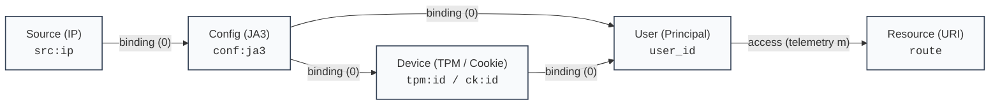
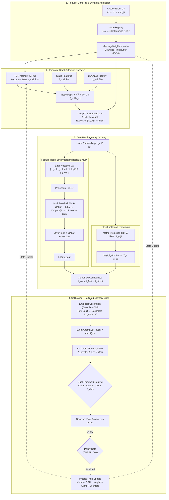
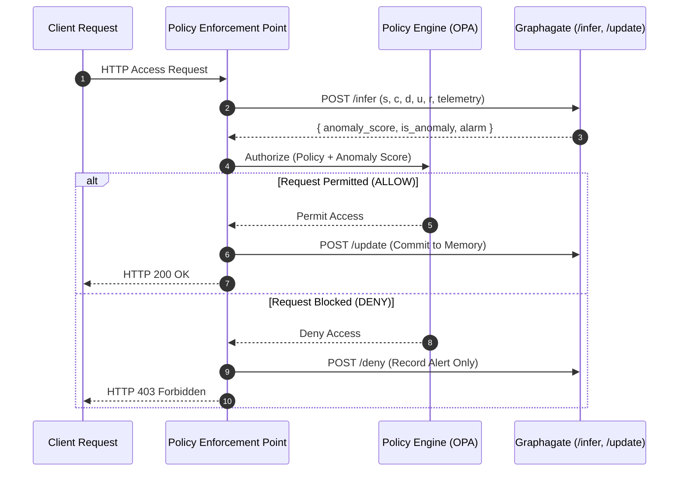

# Graphagate


Graphagate is a high-throughput **Temporal Graph Network (TGN)** microservice for **one-class anomaly detection** in Zero Trust Architectures (ZTA). It analyzes continuous authentication and authorization request streams to uncover stealthy lateral movement, credential abuse, and reconnaissance without requiring an external graph database.

---

## Key Highlights

- **5-Entity Heterogeneous Dynamic Graph**: Deconstructs every access request into a causal 5-edge chain spanning client network, TLS fingerprint, device hardware posture, user principal, and target asset.
- **Dual-Head Anomaly Scoring**: Combines a **Deep Residual MLP Feature Head** (evaluating contextual telemetry, interaction counters, and harmonic recency) with a **Normalized Metric Structural Head** (flagging unhabitual topological pairings).
- **Two-Stage Optimization Regime**:
  - **Stage 1 (Joint Learning)**: End-to-end representation learning across memory, temporal GNN attention, and scoring heads with Cosine Annealing.
  - **Stage 2 (Feature-Head Fine-Tuning)**: Freezes graph memory and attention backbones, fine-tuning the residual MLP with in-batch hard negative mining to sharpen decision boundaries.
- **In-Memory Streaming Inference ($O(1)$ RAM State)**: Tracks recurrent node memories and temporal neighborhood buffers ($K=30$) in pre-allocated ring buffers.
- **Anti-Poisoning Policy Gate**: State updates commit strictly via a predict-then-update mechanism for policy-admitted events (`OPA ALLOW`), insulating historical baselines from adversarial poisoning.
- **Calibrated Multi-Threshold Routing & Kill-Chain Prior**: Maps raw logits into empirical upper-tail log-odds, routes clean vs. dirty requests against cost-sensitive operating points, and boosts alert sensitivity using a 72-hour half-life precursor prior.

---

## Access Graph Representation

Each access request $e_i = (t_i, s_i, c_i, d_i, u_i, r_i, \mathbf{m}_i)$ is unrolled into a directed causal chain across five typed entities:

| Entity Type | Identifier Key | Representation & Semantics | Static Attributes ($\mathbf{f}_v \in \mathbb{R}^{16}$) |
|---|---|---|---|
| **Source** ($s$) | `src:<ip>` | Client network IP address (RFC1918 internal / external) | Network locality flag |
| **Config** ($c$) | `conf:<ja3>` | Client TLS fingerprint (JA3 software profile; `conf:guest` fallback) | Software client profile |
| **Device** ($d$) | `tpm:<id>` / `ck:<id>` | TPM-attested hardware identity or persistent device cookie | Hardware posture tier (0–2) |
| **User** ($u$) | `usr:<principal>` | Authenticated identity / principal claim | Role & clearance claims |
| **Resource** ($r$) | `res:<route>` | Requested asset / route URI | Sensitivity & risk classification |


```mermaid
flowchart LR
    S["Source (IP)<br/><code>src:ip</code>"]
    C["Config (JA3)<br/><code>conf:ja3</code>"]
    D["Device (TPM / Cookie)<br/><code>tpm:id / ck:id</code>"]
    U["User (Principal)<br/><code>user_id</code>"]
    R["Resource (URI)<br/><code>route</code>"]

    S -->|"binding (0)"| C
    C -->|"binding (0)"| D
    C -->|"binding (0)"| U
    D -->|"binding (0)"| U
    U -->|"access (telemetry m)"| R

    classDef nodeStyle fill:#f8fafc,stroke:#334155,stroke-width:1.5px;
    class S,C,D,U,R nodeStyle;
```

Binding edges carry zero-vectors $\mathbf{0}$ to encode structural/temporal association patterns (e.g., detecting tool switching or novel credential-device bindings), while the access edge carries current request telemetry $\mathbf{m}_i \in \mathbb{R}^7$ (TLS validity, IDS probes $s_1\text{--}s_3$, HTTP method, normalized role and clearance).

---

## Model Architecture & Pipeline


```mermaid
flowchart TD
    subgraph INP["1. Request Unrolling & Dynamic Admission"]
        EV["Access Event e_i<br/>(s, c, d, u, r, m_i)"]
        REG["NodeRegistry<br/>Key → Slot Mapping (LRU)"]
        NL["MessageNeighborLoader<br/>Bounded Ring Buffer (K=30)"]
        EV --> REG --> NL
    end

    subgraph EMB["2. Temporal Graph Attention Encoder"]
        MEM["TGN Memory (GRU)<br/>Recurrent State s_v ∈ ℝ²⁵⁶"]
        STAT["Static Features<br/>f_v ∈ ℝ¹⁶"]
        HASH["BLAKE2b Identity<br/>h_v ∈ ℝ¹⁶"]
        CAT["Node Repr: x_v⁽⁰⁾ = [ s_v ‖ f_v ‖ h_v ]"]
        GNN["3-Hop TransformerConv (H=4, Residual)<br/>Edge Attr: [ φ(Δt) ‖ m_hist ]"]
        MEM --> CAT
        STAT --> CAT
        HASH --> CAT
        CAT --> GNN
        NL --> MEM
        NL --> GNN
    end

    subgraph SCORE["3. Dual-Head Anomaly Scoring"]
        Z["Node Embeddings z_v ∈ ℝ²⁵⁶"]
        GNN --> Z

        subgraph LP["Feature Head: LinkPredictor (Residual MLP)"]
            U_IN["Edge Vector u_vw<br/>[ z_s ‖ z_d ‖ m ‖ f,h ‖ φ(Δt) ‖ c_vw ]"]
            L1["Projection + SiLU"]
            RES["M=2 Residual Blocks<br/>Linear → SiLU → Dropout(0.1) → Linear + Skip"]
            LN["LayerNorm + Linear Projection"]
            Y_FEAT["Logit ŷ_feat"]
            U_IN --> L1 --> RES --> LN --> Y_FEAT
        end

        subgraph SH["Structural Head (Topology)"]
            PROJ["Metric Projection g(z) ∈ ℝ²⁵⁶ / ‖g(z)‖"]
            Y_STR["Logit ŷ_struct = γ · ⟨ẑ_s, ẑ_d⟩"]
            PROJ --> Y_STR
        end

        Z --> LP
        Z --> SH
        COMB["Combined Confidence: ŷ_vw = ŷ_feat + ŷ_struct"]
        Y_FEAT --> COMB
        Y_STR --> COMB
    end

    subgraph INF["4. Calibration, Routing & Memory Gate"]
        CAL["Empirical Calibration (Quantile + Tail)<br/>Raw Logit → Calibrated Log-Odds ℓ̃"]
        MAX["Event Anomaly: ℓ_event = max ℓ̃_vw"]
        PREC["Kill-Chain Precursor Prior<br/>Δ_prec(d, t) (t_½ = 72h)"]
        ROUT{"Dual-Threshold Routing<br/>Clean: θ_clean | Dirty: θ_dirty"}
        DEC["Decision: Flag Anomaly vs Allow"]
        GATE{"Policy Gate<br/>(OPA ALLOW)"}
        UPD["Predict-Then-Update<br/>Memory GRU + Neighbor Store + Counters"]

        COMB --> CAL --> MAX --> PREC --> ROUT --> DEC
        DEC -->|Allow| GATE
        GATE -->|Admitted| UPD
        UPD -.->|State Update| MEM
        UPD -.->|State Update| NL
    end
```

### Core Components

1. **Deterministic Hashed Identity (`hash_emb`)**: Open-world entities are hashed via BLAKE2b into $10^5$ buckets to produce inductive identity representations $\mathbf{h}_v \in \mathbb{R}^{16}$ without retraining.
2. **Recurrent Memory & Bounded Neighbors**: TGN GRU maintains continuous-time state $\mathbf{s}_v \in \mathbb{R}^{256}$. Ring buffers store the last $K=30$ temporal interactions per entity in constant memory.
3. **Graph Attention Encoder (`gnn`)**: 3-hop multi-head `TransformerConv` ($H=4$, residual connections) embeds historical message attributes and harmonic relative time encodings $\phi(\Delta t) \in \mathbb{R}^{32}$.
4. **Deep Residual LinkPredictor (`link_pred`)**: Evaluates edge attributes, node embeddings, and causal interaction counters $\mathbf{c}_{vw} = [\log(1+n_{vw}), \log(1+n_v), \frac{n_{vw}}{n_v+1}]$. Built with SiLU non-linearities, dropout ($p=0.1$), two residual blocks ($M=2$, `hidden_layers=3`), and pre-output LayerNorm.
5. **Structural Head (`struct_proj`)**: Projects representations onto a normalized metric hypersphere; calculates scaled cosine affinity $\gamma \langle \hat{\mathbf{z}}_s, \hat{\mathbf{z}}_d \rangle$ to detect lateral pivots independent of telemetry.
6. **Inference & Tail Calibration**: Edge anomaly logits are calibrated against validation quantiles and extreme-value Pareto tails, converted to commensurate log-odds, boosted by an exponential kill-chain prior ($S_{\max} = 4.0\text{ nats}$, $t_{1/2} = 72\text{h}$), and evaluated against dual operating thresholds.

---

## Training Strategy

Training runs strictly on benign traffic ($y=0$) under a self-supervised regime:

- **Loss Formulation**:
  $$\mathcal{L} = \mathcal{L}_{\mathrm{NCE}}^{\mathrm{access}} + \mathcal{L}_{\mathrm{pos}}^{\mathrm{access}} + \mathcal{L}_{\mathrm{ctx}} + \sum_{(v, w) \in E^{\mathrm{bind}}} \left(\mathcal{L}_{\mathrm{NCE}}^{(v,w)} + \mathcal{L}_{\mathrm{pos}}^{(v,w)}\right)$$
  - **InfoNCE Ranking**: Ranks the true destination against $K=5$ structural negatives using in-batch hard negative mining (75% uniform random, 25% active batch destinations).
  - **Positive BCE Anchoring**: Prevents constant logit drift, anchoring nominal logits high for FPR calibration.
  - **Contextual Negative Regularization**: Applies Gaussian perturbations ($\boldsymbol{\epsilon} \sim \mathcal{N}(\mathbf{0}, 0.25\mathbf{I})$) to access telemetry to penalize off-manifold attributes.
- **Two-Stage Optimization**:
  - **Stage 1 (15 epochs)**: Full network training via AdamW ($\mathrm{lr}=10^{-3}$, weight decay $10^{-4}$) with a `CosineAnnealingLR` scheduler.
  - **Stage 2 (5 epochs)**: Memory and GNN attention layers are frozen; the residual LinkPredictor MLP is fine-tuned at $\mathrm{lr}_{\mathrm{ft}} = 10^{-4}$ to sharpen discrimination.

---

## Benchmark Results

Evaluated on a continuous synthetic ZTA benchmark ($N = 200{,}000$ events, $\approx 306$ days, chronological split 70% train / 10% val / 20% test, 3 random seeds). All baselines receive identical tabular signals, static features, and causal interaction counters:

| Model | Agg AUC | Agg AP | Lateral Movement AUC | Lateral Recall @ 1% FPR |
|---|:---:|:---:|:---:|:---:|
| Isolation Forest | 0.592 ± 0.030 | 0.347 ± 0.033 | 0.537 ± 0.023 | 0.9% |
| One-Class SVM | 0.633 ± 0.013 | 0.438 ± 0.016 | 0.469 ± 0.019 | 0.7% |
| Static GNN (Graph, No Temporal) | 0.753 ± 0.004 | 0.674 ± 0.008 | 0.602 ± 0.024 | 13.9% |
| TGN 2-Node ($u \to r$) | 0.854 ± 0.023 | 0.822 ± 0.028 | 0.659 ± 0.024 | 17.0% |
| **Graphagate TGN (Full 5-Node)** | **0.853 ± 0.013** | **0.801 ± 0.013** | **0.721 ± 0.011** | **16.1%** |
| *XGBoost (Supervised Upper-Bound)* | *0.924 ± 0.008* | *0.892 ± 0.008* | *0.783 ± 0.021* | *20.2%* |

> **Impact of Configuration Node (Schema v4)**: Introducing the TLS fingerprint node ($c$) lifts operational cost-sensitive lateral recall from **20.2%** to **48.5%** (+0.283) and enhances credential theft detection by exposing client-principal mismatches.

---

## Quickstart & Deployment

### Docker Compose Profiles

All services and validation pipelines run containerized with CUDA 13 support:

```bash
# 1. Train the streaming model (Stage 1 + Stage 2) and save artifacts to public/
docker compose --profile training-tgn up

# 2. Verify serving correctness and train/replay parity
docker compose --profile verify-tgn up

# 3. Launch HTTP REST/JSON inference microservice (Port 8888 -> 8088)
docker compose --profile serve-tgn up
```

### Standalone Python Execution

```bash
# Install dependencies with uv or pip
uv pip install -e .

# Run training pipeline
python -m src.train_tgn

# Run verification harness
python -m src.verify_tgn

# Launch FastAPI inference service
python -m src.serve_api
```

---

## REST API & ZTA Integration

The microservice (`src/serve_api.py`) runs on FastAPI at port `8088` (mapped to host `8888`):

| Endpoint | Method | Description |
|---|---|---|
| `/infer` | `POST` | Scores incoming access request tuple; returns anomaly score, flag, and precursor state. |
| `/update` | `POST` | Commits policy-admitted request (`OPA ALLOW`) to temporal memory and neighbor buffers. |
| `/deny` | `POST` | Records alert triggers for denied requests without updating temporal memory. |
| `/score` | `POST` | Standalone scoring with conditional self-update (OPA-less mode). |
| `/health` | `GET` | Service readiness probe (returns 503 during model initialization, 200 when ready). |

### Integration Pattern


```mermaid
sequenceDiagram
    autonumber
    participant Client as Client Request
    participant PEP as Policy Enforcement Point
    participant PDP as Policy Engine (OPA)
    participant TGN as Graphagate (/infer, /update)

    Client->>PEP: HTTP Access Request
    PEP->>TGN: POST /infer (s, c, d, u, r, telemetry)
    TGN-->>PEP: { anomaly_score, is_anomaly, alarm }
    PEP->>PDP: Authorize (Policy + Anomaly Score)
    alt Request Permitted (ALLOW)
        PDP-->>PEP: Permit Access
        PEP->>TGN: POST /update (Commit to Memory)
        PEP-->>Client: HTTP 200 OK
    else Request Blocked (DENY)
        PDP-->>PEP: Deny Access
        PEP->>TGN: POST /deny (Record Alert Only)
        PEP-->>Client: HTTP 403 Forbidden
    end
```

Detailed integration examples (Go client, OPA Rego rules, environment settings) are available in [`docs/development/orchestrator_integration.md`](docs/development/orchestrator_integration.md).

---

## Project Layout

```text
docs/
├── development/             # Architectural specifications & orchestrator integration guides
└── paper/                   # Academic manuscript (main.tex, results.tex, refs.bib)
scripts/                     # Paper compilation utilities (build_paper.sh, build_paper.ps1)
src/
├── config.py                # Hyperparameters, dimensions, and model configurations
├── data/
│   └── stream_synthetic.py  # ZTA stream simulator (policy, lateral, credential theft)
├── model/
│   ├── tgn.py               # ZTATemporalGraphNetwork, residual LinkPredictor, structural head
│   ├── neighbor.py          # MessageNeighborLoader (bounded in-RAM ring buffer)
│   └── registry.py          # NodeRegistry (dynamic admission & LRU slot management)
├── train_tgn.py             # Two-stage self-supervised training & calibration pipeline
├── serve_tgn.py             # Serving primitives, memory updates, and persistence
├── serve_api.py             # FastAPI REST microservice
└── verify_tgn.py            # Stream replay parity & verification test harness
public/                      # Model checkpoints (tgn_checkpoint.pt) & statistics (tgn_stats.json)
docker/Dockerfile            # CUDA-accelerated container image
```

---

## License

This project is licensed under the MIT License — see the [LICENSE](LICENSE) file for details.
